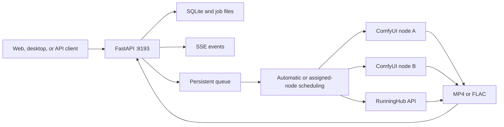

<div align="center">


# MiniMax H3 Studio

A Web service and desktop application for MiniMax H3 video, character voice, and Music3 generation

[](https://www.python.org/)
[](https://fastapi.tiangolo.com/)
[](https://github.com/Comfy-Org/ComfyUI)
[](https://huggingface.co/MiniMaxAI/MiniMax-H3)
[](https://huggingface.co/MiniMaxAI/MiniMax-Music3)

[中文](README.md) | English

[Features](#features) · [Generation modes](#generation-modes) · [ComfyUI node packages](#comfyui-node-packages) · [Deployment](#quick-deployment) · [Desktop app](#desktop-app) · [API](#api) · [Documentation](#documentation)

</div>

MiniMax H3 Studio runs as either a server application or a local desktop application. The server exposes a responsive Web interface and HTTP API around ComfyUI and RunningHub workflows. It handles uploads, validation, persistent queues, live progress, node scheduling, and output management. The desktop application runs FastAPI and pywebview locally while sending inference requests to a configured remote ComfyUI node. Tasks, assets, outputs, node configuration, and credentials remain on the local machine.

Supported workflows include H3 FL2VA, Ref2VA, 8-step LoRA v1.0, single-image audio-driven digital humans, H3 TTS, Music3 INT8, generic RunningHub workflows, and an optional H3 NSFW workflow.


> [!IMPORTANT]
> Model weights are not included in this repository. Review the license terms for MiniMax H3, MiniMax Music3, related LoRAs, ComfyUI, and custom nodes before deployment.

## Features

| Area | Capabilities |
|---|---|
| Generation | Model, execution mode, inference node, aspect ratio, resolution, duration, steps, seed, and incognito mode |
| Conversation | Recent records, upward pagination, device filters, live progress, downloads, edits, cancellation, deletion, and parameter refill |
| Asset library | Paginated loading, search, status filters, previews, details, downloads, refill, and local artifact management |
| Node manager | ComfyUI and RunningHub node creation, editing, enable/disable, deletion, health checks, and concurrency settings |
| Prompt tools | H3 prompt optimization, Music3 style optimization, Music3 lyric generation, and streamed responses |
| Device sharing | LAN or Tailscale pairing, persistent authorization, revocation, and owner-labeled shared assets |
| Runtime logs | Draggable launcher and detail window with mouse and touch input |

Enabling runtime logs in Settings shows the launcher while the detail window remains closed. Runtime updates preserve the selected conversation-device filters.

## Generation modes

| Mode | Model | Input | Parameters and output |
|---|---|---|---|
| Native FL2VA | FL2VA FP8 Scaled | One first frame and an optional last frame | 1 to 15 seconds, 4 to 50 steps, MP4 |
| Native Ref2VA | Ref2VA FP8 Scaled | Up to 9 images, 3 videos, and 3 audio clips | 1 to 15 seconds, 4 to 50 steps, MP4 |
| 8-step FL2VA | FL2VA FP8 Scaled with 8-step LoRA v1.0 | One first frame and an optional last frame | Fixed at 8 steps, LoRA strength 1.0, MP4 |
| 8-step Ref2VA | Ref2VA FP8 Scaled with the FL2VA 8-step LoRA v1.0 | Ref2VA reference assets | Fixed at 8 steps, LoRA strength 1.0, MP4 |
| Digital human | Ref2VA FP8 Scaled | One character image and one driving audio file | Audio determines duration, fixed at 20 steps, MP4 |
| H3 TTS | Ref2VA FP8 Scaled | Character traits, dialogue, and 0 to 3 audio references | 1 to 15 seconds, 4 to 50 steps, FLAC |
| Music3 | Music3 DiT INT8 and INT8 text encoder | Music description and optional section-tagged lyrics | 1 to 300 seconds, fixed at 30 steps, FLAC |
| H3 NSFW | Ref2VA FP8 Scaled with NaughtyTimes LoRA | Ref2VA reference assets | Incognito mode only, MP4 |
| RunningHub | Model defined by the target workflow | Text, numeric, enum, switch, and media fields | Defined by the target workflow |

### Digital human

The digital-human workflow uses a character image and driving audio to produce a lip-synchronized video. The service reads the actual audio duration with `ffprobe` and uses it as the video duration. The workflow requires `VRGDG_MiniMaxH3AudioDrive`.


### H3 TTS

H3 TTS uses Ref2VA FP8 to generate character voice. The prompt describes character traits, delivery, and dialogue. Up to three audio files can provide speaker voice references. The service fixes the visual latent at 32x32, decodes audio only, and saves FLAC.

### Music3

Music3 accepts a music description and section-tagged lyrics and returns 32 kHz, 16-bit stereo FLAC. The API workflow uses 30 Euler steps and the repository patch enables forced-duration generation.

### RunningHub

A RunningHub node uses the complete HTTPS URL of a workflow or AI app. The service reads the resource ID, workflow name, parameter schema, and output type to build the input controls. API keys are stored in SQLite and node responses expose only whether a key is saved.

## ComfyUI node packages

The root-level [`comfyui_nodes/`](comfyui_nodes/) directory contains pinned source packages for every workflow dependency. Each dependency is distributed separately. Sources, commits, licenses, and SHA-256 checksums are recorded in [`comfyui_nodes/manifest.json`](comfyui_nodes/manifest.json).

| Package | Purpose | Installation path |
|---|---|---|
| `ComfyUI-core-7fe8a61.zip` | Core loading, sampling, MiniMax H3, Music3, and audio/video nodes referenced by the workflows | ComfyUI installation root |
| `ComfyUI-VideoHelperSuite-993082e.zip` | `VHS_LoadVideo` for Ref2VA video references | `ComfyUI/custom_nodes/` |
| `ComfyUI-MultiGPU-62f98ed.zip` | `CLIPLoaderMultiGPU` for Music3 | `ComfyUI/custom_nodes/` |
| `comfyui-minimax-h3-audio-drive-de65ec5.zip` | `VRGDG_MiniMaxH3AudioDrive` for the digital-human workflow | `ComfyUI/custom_nodes/` |

Extract the custom-node archives and place their top-level directories under `ComfyUI/custom_nodes/`. Install any included `requirements.txt` with the Python environment used by ComfyUI.

> [!IMPORTANT]
> Music3 forced-duration generation also requires [`patches/comfyui-music3-force-duration.patch`](patches/comfyui-music3-force-duration.patch). `scripts/install.sh` applies this patch automatically.

The digital-human archive is a minimal package containing only the `VRGDG_MiniMaxH3AudioDrive` node used by the current workflow. It retains the upstream AGPL-3.0 notice. The current API workflows do not depend on ComfyUI-SoundFlow.

## Architecture



Each ComfyUI node has one execution slot. RunningHub capacity is controlled by `max_concurrency`. Automatic scheduling assigns jobs across available online slots.

## System requirements

The following baseline covers one 608x352, 5-second task:

| Item | Requirement |
|---|---|
| Operating system | Ubuntu 22.04 x86_64 |
| GPU | One NVIDIA GPU with 24 GB VRAM; RTX 4090 verified |
| Driver | NVIDIA 550.54.14 or newer, subject to the installed CUDA Runtime |
| Memory | 64 GB RAM with at least 32 GB swap |
| Storage | At least 100 GB of available SSD space |
| Python | 3.11 or newer |
| Tools | Git, FFmpeg, aria2, rsync, curl, OpenSSL, and systemd |

Higher resolutions, longer videos, and concurrent multi-node execution require additional memory and storage.

## Quick deployment

Run on the cloud GPU server:

```bash
git clone https://github.com/SekiyoKana/minimax-h3-api.git
cd minimax-h3-api

INSTALL_ROOT=/data/minimax-h3-stack \
GPU_ID=0 \
MODEL_PROVIDER=modelscope \
bash scripts/install.sh
```

The installer:

1. Installs pinned versions of ComfyUI, ComfyUI-VideoHelperSuite, and ComfyUI-MultiGPU.
2. Creates separate Python environments for ComfyUI and the API.
3. Downloads approximately 77.3 GB of models and verifies sizes and SHA-256 hashes.
4. Applies the Music3 forced-duration patch.
5. Generates `.env` and a random incognito access code.
6. Installs and starts `comfyui.service` and `minimax-h3-api.service`.

After installation:

| Address | Purpose |
|---|---|
| `http://SERVER_IP:8193/` | Generation interface |
| `http://SERVER_IP:8193/docs` | OpenAPI interactive documentation |
| `http://SERVER_IP:8193/health` | Service, queue, and node health |

Only port 8193 needs to be exposed to users. ComfyUI listens on `127.0.0.1:8188` by default.

See the [cloud GPU deployment guide](docs/en/DEPLOYMENT.md) for all installation parameters.

## Desktop app

The desktop app supports macOS and Windows. The local machine hosts the interface, job records, assets, outputs, node configuration, AI configuration, and device-sharing authorization. Remote ComfyUI performs model loading and GPU inference.

### Run locally

```bash
python3 -m venv .venv-desktop
. .venv-desktop/bin/activate
pip install -r requirements-desktop.txt
python scripts/run_desktop.py
```

Override the remote node and local port with environment variables:

```bash
H3_DEFAULT_COMFY_URL=http://192.168.1.20:8188 \
H3_DEFAULT_COMFY_NAME="Remote ComfyUI" \
H3_DESKTOP_PORT=38193 \
python scripts/run_desktop.py
```

Local data directories:

| System | Directory |
|---|---|
| macOS | `~/Library/Application Support/MiniMax H3 Studio` |
| Windows | `%LOCALAPPDATA%\\MiniMax H3 Studio` |

### Package the app

```bash
pip install -r requirements-desktop.txt
python scripts/build_desktop.py
```

macOS produces `dist/MiniMaxH3Studio.app` and `dist/MiniMaxH3Studio.dmg`. Windows produces `dist/MiniMaxH3Studio/`. Run PyInstaller on the target operating system.

See the [desktop app guide](docs/DESKTOP.md) for packaging and device sharing details.

## Multi-node scheduling

Use the server icon in the page header to manage ComfyUI and RunningHub nodes. Node addresses, keys, workflow schemas, account data, and the health-check interval are stored in `data/config.db`.

When multiple ComfyUI processes run on one server, assign each process an independent port, GPU, user directory, and database:

| Node | API address | GPU |
|---|---|---|
| GPU 0 | `http://127.0.0.1:8188` | `CUDA_VISIBLE_DEVICES=0` |
| GPU 1 | `http://127.0.0.1:8189` | `CUDA_VISIBLE_DEVICES=1` |

The API service must be able to reach every remote node. Restrict ComfyUI ports at the network layer when nodes run on separate hosts.

## API

Create an 8-step FL2VA job:

```bash
curl -X POST http://127.0.0.1:8193/api/v1/generations \
  -F 'prompt=Locked camera. A person stands beside a window while the curtain moves gently.' \
  -F 'reference_manifest=[{"type":"image"}]' \
  -F 'references=@first-frame.png;type=image/png' \
  -F 'model_variant=fl2va-fp8' \
  -F 'execution_mode=turbo-lora' \
  -F 'comfy_node=auto' \
  -F 'width=864' \
  -F 'height=480' \
  -F 'duration=5' \
  -F 'steps=8'
```

Main endpoints:

| Method | Path | Purpose |
|---|---|---|
| `GET` | `/health` | Service, queue, node, and capacity status |
| `GET`, `POST` | `/api/v1/comfy/nodes` | List and create nodes |
| `PATCH`, `DELETE` | `/api/v1/comfy/nodes/{node_id}` | Update and delete nodes |
| `GET`, `POST` | `/api/v1/generations` | List and create jobs |
| `GET` | `/api/v1/events` | SSE tasks, queue, logs, and node events |
| `POST` | `/api/v1/prompts/optimize` | H3 prompt optimization |
| `POST` | `/api/v1/music/assist` | Music3 style optimization and lyric generation |

When `H3_API_KEY` is set, every `/api/v1/*` request requires a Bearer token. See the [API guide](docs/en/API.md) for request fields and examples.

## Configuration

| Environment variable | Default | Description |
|---|---|---|
| `H3_HOST` | `0.0.0.0` | API listen address |
| `H3_PORT` | `8193` | Web and API port |
| `H3_API_KEY` | Empty | Optional Bearer token |
| `H3_INCOGNITO_CODE` | Random value | Incognito-mode access code |
| `H3_MAX_UPLOAD_MB` | `512` | Maximum size of one upload |
| `H3_REMOTE_RECONNECT_SECONDS` | `120` | Remote task status reconnect window |
| `CUDA_VISIBLE_DEVICES` | `GPU_ID` | Physical GPU used by the default ComfyUI node |

Node addresses and the health-check interval can be changed through the Web interface or API and take effect immediately.

## Verification

Run the full test suite:

```bash
python3 -m unittest discover -s tests -p 'test_*.py'
```

Verify deployed models, nodes, services, and queue state:

```bash
INSTALL_ROOT=/data/minimax-h3-stack bash scripts/verify_install.sh
```

## Repository structure

```text
app/                  FastAPI, queue, scheduling, and inference clients
comfyui_nodes/        Pinned ComfyUI and custom-node archives
desktop.py            pywebview desktop entry point
static/               Responsive Chinese and English interface
workflows/            H3 and Music3 ComfyUI API workflows
patches/              ComfyUI compatibility and feature patches
scripts/              Installation, packaging, model, verification, and smoke tests
deploy/               systemd user-service templates
docs/                 API, deployment, model, workflow, and operations guides
tests/                Service and desktop contract tests
model-manifest.json   Model sources, sizes, SHA-256 hashes, and license metadata
```

## Documentation

- [Cloud GPU deployment](docs/en/DEPLOYMENT.md)
- [Agent installation guide](AGENT.md)
- [Desktop app](docs/DESKTOP.md)
- [API requests](docs/en/API.md)
- [Model manifest](docs/en/MODELS.md)
- [Workflow manifest](docs/en/WORKFLOWS.md)
- [ComfyUI node packages](comfyui_nodes/README.md)
- [Operations](docs/en/OPERATIONS.md)
- [Verification snapshot](docs/en/PROJECT_SNAPSHOT.md)
- [Security](SECURITY.en.md)
- [Third-party projects and licenses](THIRD_PARTY_NOTICES.en.md)
