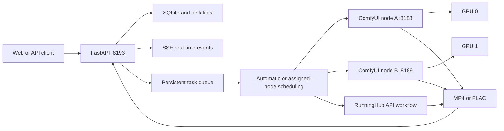

<div align="center">

# MiniMax Full Model API / WebUI

A ComfyUI and RunningHub API Web service for MiniMax H3 video and MiniMax Music3 audio generation

[](https://www.python.org/)
[](https://fastapi.tiangolo.com/)
[](https://github.com/comfyanonymous/ComfyUI)
[](https://huggingface.co/MiniMaxAI/MiniMax-H3)
[](https://huggingface.co/MiniMaxAI/MiniMax-Music3)

[中文](README.md) | English

[Feature Updates](#feature-updates) · [Generation Modes](#generation-modes) · [Quick Deployment](#quick-deployment) · [Multi-node Scheduling](#multi-node-scheduling) · [API](#api) · [Documentation](#documentation)

</div>

The project wraps ComfyUI and RunningHub workflows in a responsive Web interface and HTTP API. It manages asset uploads, parameter validation, persistent queues, real-time progress, node scheduling, generated artifacts, and privacy isolation. Current workflows include H3 FL2VA, Ref2VA, 8-step LoRA v1.0, audio-driven digital humans, Music3 INT8, and an optional H3 NSFW mode.


> [!IMPORTANT]
> Model weights are not committed to Git. Review and accept the license terms for MiniMax H3, MiniMax Music3, related LoRAs, ComfyUI, and custom nodes before deployment.

## Feature Updates

### 2026-08-17

**RunningHub API Nodes**

- Inference nodes now support `comfyui` and `runninghub` providers with automatic or manual task routing.
- RunningHub nodes store an API key, a workflow or AI app URL, and maximum concurrency. The service resolves the resource ID, workflow name, input schema, and output type.
- RunningHub API keys remain in the server-side SQLite database. Node responses expose only whether a key is saved.
- Scheduling capacity is the sum of available node slots. A ComfyUI node has one slot, while a RunningHub node uses its configured maximum concurrency.
- RunningHub node status displays the current API-key balance, account task count, and the balance difference measured for the most recent call. Account-query failures preserve the latest data and record the error without marking the node offline.
- Generic AI apps and regular workflows follow the [official RunningHub API documentation](https://www.runninghub.ai/runninghub-api-doc-en/). The interface renders text, number, enum, switch, and media controls from each workflow schema.

**Generation Composer**

- Combined parameters, quick actions, advanced settings, and the generate button into one toolbar row.
- Added an `@` hover menu for inserting uploaded image names and running quick actions. H3 provides prompt optimization, while Music3 provides style and lyric optimization.

### 2026-08-14

**Music3 INT8**

- Added a MiniMax Music3 INT8 workflow with music-description and section-tagged lyric inputs for tracks up to 300 seconds.
- Music3 API jobs enable forced-duration mode, suppressing the model end token until the requested duration is reached.
- Produces 32 kHz, 16-bit stereo FLAC with a fixed 30-step Euler sampler.
- Added AI Arrangement and AI Lyrics. AI Arrangement follows the official MiniMax Music3 `music-caption-rewriter` Structured Caption specification. AI Lyrics returns section-tagged lyrics ready for Music3 input.
- The Music3 CUDA device is read from `/system_stats` on the ComfyUI node assigned to the task. Music3 therefore uses the CUDA device exposed by that node.

**Multi-node Concurrency**

- Added a ComfyUI node manager with create, read, update, enable, disable, and delete operations.
- Node IDs are generated by the service. Node addresses and the status-refresh interval are stored in `data/config.db`.
- Node status is refreshed every 60 seconds by default. The interval can be changed in the Web interface from 5 to 3600 seconds.
- Supports automatic load balancing and manual node selection. Each online node runs one task, so the online node count determines the current parallel capacity.
- Task records, the runtime panel, and asset details identify the host that executed each task.

**Web Interaction**

- Uses Server-Sent Events to synchronize tasks, queues, logs, and node status in real time, with automatic reconnection.
- Loads the 10 most recent conversations initially and loads older records when scrolling upward.
- Loads more assets when the library reaches the scroll boundary. Search and status filters use the paginated API.
- Music3 assets use a single audio icon in the library and play from the asset-detail dialog.
- Asset cards open a detail dialog containing the output, source files, and prompt, with actions to refill the composer or delete the record.
- Conversation entries can refill their parameters and source files into the composer.
- Added Chinese and English switching, an OpenAPI documentation shortcut, and responsive layouts for phones and narrow screens.

**Resource Management**

- Calls ComfyUI `/free` after every task to unload models and release VRAM. The release path runs after completed, failed, and cancelled tasks.

### 2026-08-13

- Rewrote the Chinese and English project documentation and added workspace, digital-human, and OpenAPI screenshots.

### 2026-08-12

- Added a single-image, audio-driven digital-human workflow. The driving audio determines video length, and the disabled duration control explains this behavior.
- Replaced the 4-step acceleration workflow with LightX2V MiniMax H3 8-step LoRA v1.0.
- A dedicated Ref2VA 8-step LoRA has not been released. The Ref2VA accelerated workflow currently uses the FL2VA 8-step LoRA v1.0.

### 2026-08-07

- Established the deployment baseline for FL2VA, Ref2VA, the persistent queue, asset library, incognito mode, installation script, and systemd user services.

## Generation Modes

| Mode | Model and sampling | Input | Parameters and output |
|---|---|---|---|
| Native FL2VA | FL2VA FP8 Scaled | 1 first-frame image and an optional last-frame image | 1 to 15 seconds, 4 to 50 steps, MP4 |
| Native Ref2VA | Ref2VA FP8 Scaled | Up to 9 images, 3 videos, and 3 audio clips | 1 to 15 seconds, 4 to 50 steps, MP4 |
| 8-step FL2VA | FL2VA FP8 Scaled with 8-step LoRA v1.0 | 1 first-frame image and an optional last-frame image | Fixed at 8 steps, LoRA strength 1.0, MP4 |
| 8-step Ref2VA | Ref2VA FP8 Scaled with FL2VA 8-step LoRA v1.0 | Up to 9 images, 3 videos, and 3 audio clips | Fixed at 8 steps, LoRA strength 1.0, MP4 |
| Digital Human | Ref2VA FP8 Scaled, audio driven | 1 portrait image and 1 driving audio clip | Audio determines length, fixed at 20 steps, MP4 |
| Music3 | Music3 INT8 DiT and INT8 text encoder | Music description and optional section-tagged lyrics | 1 to 300 seconds, fixed at 30 steps, FLAC |
| H3 NSFW | Ref2VA FP8 Scaled with NaughtyTimes LoRA | Ref2VA reference assets | Incognito mode only, MP4 |

### Digital Human

Digital-human mode preserves identity, facial structure, clothing, and source audio while driving lip movement from the audio. The service reads the actual audio duration with `ffprobe` and overrides the duration field in the task request.


This workflow requires the `VRGDG_MiniMaxH3AudioDrive` node from `comfyui-vrgamedevgirl`. `ComfyUI-SoundFlow` is optional because the current API workflow does not call `SoundFlow_GetLength`.

> [!WARNING]
> `scripts/install.sh` does not currently install the digital-human plugin. Install `comfyui-vrgamedevgirl` under `ComfyUI/custom_nodes/` and restart the corresponding ComfyUI node before using this mode.

### Music3

Music3 uses ComfyUI's native `MiniMaxMusic3TextEncode` and `EmptyMiniMaxMusic3LatentAudio` nodes together with `CLIPLoaderMultiGPU` from ComfyUI-MultiGPU. The service injects the CUDA device reported by the executing node into the workflow, preventing the text encoder from falling back to CPU. API jobs enable forced-duration mode, suppressing `<|audio_end|>` until the requested duration is reached.

> [!NOTE]
> `comfy-kitchen` must be compatible with the CUDA Runtime supported by the server driver. The verified server uses NVIDIA driver `575.51.03` with a local CUDA 12.9 build. If the log reports `CUDA driver version is insufficient for CUDA runtime version`, check the wheel's CUDA version against the driver's supported range.

## Web Features

| Area | Features |
|---|---|
| Generation | Model, workflow, node, aspect ratio, resolution, duration, steps, seed, and incognito mode |
| Prompts | H3 prompt optimization, Music3 AI Arrangement, AI Lyrics, and streamed output |
| Conversation | Latest 10 records, upward history loading, progress, host labels, downloads, edits, cancellation, deletion, and composer refill |
| Asset library | Infinite loading, search, status filtering, detail dialog, previews, composer refill, and deletion |
| Node manager | ComfyUI and RunningHub node CRUD, generated IDs, health status, concurrency, check interval, enable, and disable controls |
| Page settings | Chinese and English switching, OpenAPI shortcut, and responsive mobile layout |


## Architecture



FastAPI creates one task worker for each ComfyUI node and creates the configured number of task slots for each RunningHub node. Reference assets are uploaded through the selected provider API, and generated outputs are returned over HTTP.

## System Requirements

The following baseline applies to one running task:

| Item | Requirement |
|---|---|
| Operating system | Ubuntu 22.04 x86_64 |
| GPU | 1 NVIDIA GPU with 24 GB VRAM; RTX 4090 verified |
| Driver | NVIDIA 550.54.14 or newer, subject to the installed CUDA Runtime requirements |
| Memory | 64 GB RAM with at least 32 GB swap |
| Storage | At least 100 GB of available SSD storage |
| Python | 3.11 or newer |
| Tools | Git, FFmpeg, aria2, rsync, curl, OpenSSL, and systemd |

The 64 GB memory baseline covers a single 608 × 352, 5-second task. Higher resolutions, longer videos, and concurrent multi-node execution require additional memory and storage.

## Quick Deployment

Run on the cloud GPU server:

```bash
git clone https://github.com/SekiyoKana/minimax-h3-api.git
cd minimax-h3-api

INSTALL_ROOT=/data/minimax-h3-stack \
GPU_ID=0 \
MODEL_PROVIDER=modelscope \
bash scripts/install.sh
```

The installation script performs the following operations:

1. Installs pinned revisions of ComfyUI, ComfyUI-VideoHelperSuite, and ComfyUI-MultiGPU.
2. Creates separate Python virtual environments for ComfyUI and the API.
3. Downloads approximately 77.3 GB of models, preferring ModelScope, and verifies file sizes and SHA-256 hashes.
4. Generates `.env` and a random incognito access code.
5. Installs and starts `comfyui.service` and `minimax-h3-api.service`.

Open the following addresses after installation:

| Address | Purpose |
|---|---|
| `http://SERVER_IP:8193/` | Generation interface |
| `http://SERVER_IP:8193/docs` | OpenAPI interactive documentation |
| `http://SERVER_IP:8193/health` | Service, queue, and node health |

Only port 8193 needs to be exposed to users. ComfyUI listens on `127.0.0.1:8188` by default.

See the [cloud GPU deployment guide](docs/en/DEPLOYMENT.md) for all installation parameters, existing model directories, and public deployment requirements.

## Multi-node Scheduling

Use the server icon in the page header to manage ComfyUI and RunningHub inference nodes. Choose the provider and enter a name when adding a node; the service generates its ID. A task can use ComfyUI automatic scheduling, a concrete node, or a RunningHub workflow-specific automatic option. Available nodes with the same RunningHub resource ID share concurrency capacity.

For a RunningHub node, provide a name, API key, full RunningHub workflow or AI app URL, and maximum concurrency. The service derives the API base URL and reads the resource ID, workflow name, parameter schema, and output type. Node query responses never return the API key. Leaving the key field empty while editing preserves the saved key.

AI app parameters come from the official `apiCallDemo` and `webapp/detail` endpoints. Regular workflow parameters come from `getJsonApiFormat`. Selecting a RunningHub node hides the fixed H3 model, size, duration, and step controls and displays fields for the selected workflow. Account-status failures populate `account_error` without preventing use of an already identified workflow.

When multiple nodes run on the same server, each ComfyUI process needs an independent port, GPU, user directory, and database. For example:

| Node | API address | GPU | Recommended configuration |
|---|---|---|---|
| GPU 0 | `http://127.0.0.1:8188` | `CUDA_VISIBLE_DEVICES=0` | Independent `user-directory` and `database-url` |
| GPU 1 | `http://127.0.0.1:8189` | `CUDA_VISIBLE_DEVICES=1` | Independent `user-directory` and `database-url` |

Nodes and settings are stored in:

```text
data/config.db
├── comfy_nodes       Nodes, secrets, workflow schemas, account data, recent call cost, and concurrency
└── service_settings  comfy_health_seconds, 60 seconds by default
```

> [!TIP]
> The API service must be able to reach every remote ComfyUI node URL. Restrict access to ComfyUI ports at the network layer when nodes run on separate hosts.

## API

### Create an 8-step FL2VA Task

```bash
curl -X POST http://127.0.0.1:8193/api/v1/generations \
  -F 'prompt=Locked camera. A person stands beside a window while the curtain moves gently in a quiet room.' \
  -F 'reference_manifest=[{"type":"image"}]' \
  -F 'references=@first-frame.png;type=image/png' \
  -F 'model_variant=fl2va-fp8' \
  -F 'execution_mode=turbo-lora' \
  -F 'comfy_node=auto' \
  -F 'width=864' \
  -F 'height=480' \
  -F 'duration=5' \
  -F 'steps=8'
```

### Create a Music3 Task

```bash
curl -X POST http://127.0.0.1:8193/api/v1/generations \
  -F 'prompt=Upbeat synth-pop, 118 BPM, bright female vocal, layered analog synths.' \
  -F 'lyrics=[Verse]\nCity lights are moving slow\n\n[Chorus]\nWe are awake tonight' \
  -F 'model_variant=music3-int8' \
  -F 'execution_mode=music3' \
  -F 'comfy_node=auto' \
  -F 'duration=120' \
  -F 'steps=30'
```

### Manage Nodes

```bash
# The service generates the node ID
curl -X POST http://127.0.0.1:8193/api/v1/comfy/nodes \
  -H 'Content-Type: application/json' \
  -d '{"name":"GPU 1","url":"http://127.0.0.1:8189"}'

curl -X POST http://127.0.0.1:8193/api/v1/comfy/nodes \
  -H 'Content-Type: application/json' \
  -d '{"name":"RunningHub workflow","provider":"runninghub","api_key":"YOUR_RUNNINGHUB_API_KEY","workflow_url":"https://www.runninghub.ai/zh-cn/ai-detail/2086401261143273474","max_concurrency":2}'

curl -X PATCH http://127.0.0.1:8193/api/v1/comfy/settings \
  -H 'Content-Type: application/json' \
  -d '{"health_interval_seconds":60}'
```

Main endpoints:

| Method | Path | Purpose |
|---|---|---|
| `GET` | `/health` | Service, queue, node status, and parallel capacity |
| `GET`, `POST` | `/api/v1/comfy/nodes` | List and create nodes |
| `PATCH`, `DELETE` | `/api/v1/comfy/nodes/{node_id}` | Update and delete nodes |
| `PATCH` | `/api/v1/comfy/settings` | Update the health-check interval |
| `GET`, `POST` | `/api/v1/generations` | Paginated task listing and task creation |
| `GET` | `/api/v1/events` | SSE task, queue, log, and node events |
| `POST` | `/api/v1/prompts/optimize` | H3 prompt optimization |
| `POST` | `/api/v1/music/assist` | Music3 AI Arrangement and AI Lyrics |

When `H3_API_KEY` is set, every `/api/v1/*` request requires a Bearer token. See the [API guide](docs/en/API.md) for request fields, the digital-human example, pagination, updates, cancellation, deletion, and downloads.

## Configuration

The main environment variables are stored in `<INSTALL_ROOT>/minimax-h3-api/.env`:

| Environment variable | Default | Description |
|---|---|---|
| `H3_HOST` | `0.0.0.0` | API listen address |
| `H3_PORT` | `8193` | Web and API port |
| `H3_API_KEY` | Empty | Optional Bearer token |
| `H3_INCOGNITO_CODE` | Random value | Incognito mode access code |
| `H3_MAX_UPLOAD_MB` | `512` | Maximum size for one uploaded file |
| `CUDA_VISIBLE_DEVICES` | `GPU_ID` | Physical GPU used by the default ComfyUI node created by the installer |

Node addresses and the health-check interval are changed through the Web interface or API and apply immediately without restarting the API service.

## Verification

The following command checks code tests, model files, required nodes, service status, and queue state without submitting a generation task:

```bash
INSTALL_ROOT=/data/minimax-h3-stack bash scripts/verify_install.sh
```

Check one node and the API service:

```bash
curl -fsS http://127.0.0.1:8188/system_stats
curl -fsS http://127.0.0.1:8193/health
```

## Repository Structure

```text
app/                 FastAPI, task queue, node scheduling, ComfyUI client, and prompt rules
static/              Responsive Chinese and English Web interface
workflows/           H3 and Music3 ComfyUI API workflows
scripts/             Installation, model download, verification, and generation checks
deploy/              systemd user-service templates
docs/                API, deployment, model, workflow, and operations documentation
tests/               Service contract tests
model-manifest.json  Model sources, sizes, SHA-256 hashes, and license metadata
```

## Documentation

- [Cloud GPU Deployment](docs/en/DEPLOYMENT.md)
- [API Requests](docs/en/API.md)
- [Model Manifest](docs/en/MODELS.md)
- [Workflow Manifest](docs/en/WORKFLOWS.md)
- [Operations](docs/en/OPERATIONS.md)
- [Verification Snapshot](docs/en/PROJECT_SNAPSHOT.md)
- [Security](SECURITY.en.md)
- [Third-party Projects and Licenses](THIRD_PARTY_NOTICES.en.md)
- [Chinese README](README.md)
