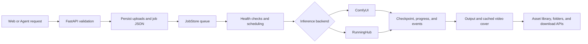

<div align="center">


# MiniMax H3 Studio

MiniMax H3 video, voice, Music3, and ComfyUI workflow control service

[](https://www.python.org/)
[](https://fastapi.tiangolo.com/)
[](https://github.com/Comfy-Org/ComfyUI)
[](https://huggingface.co/MiniMaxAI/MiniMax-H3)

[中文](README.md) | English

[Features](#features) · [Data flow](#data-flow) · [Update log](#update-log) · [Deployment](#deployment) · [API](#api) · [Validation](#validation)

</div>

MiniMax H3 Studio provides a Web interface, HTTP API, and desktop entry point for MiniMax H3, H3 TTS, audio-driven digital humans, Music3, and generic RunningHub workflows. The service validates requests, stores reference files, persists jobs, schedules inference nodes, streams events, recovers interrupted jobs, manages assets, and delivers outputs.

> [!IMPORTANT]
> Model weights are not included. Review the license terms for MiniMax H3, Music3, related LoRAs, ComfyUI, and custom nodes before deployment.

## Features

| Area | Capabilities |
|---|---|
| Video generation | FL2VA, Ref2VA, 8-step LoRA, dual sampling, H3 SA, VDN H3, digital human, and H3 NSFW |
| Audio generation | Music3 INT8 and H3 TTS with lyrics, style descriptions, and audio references |
| Long video | H3 SA frame-grid splitting, context transfer, repeated-prefix trimming, and final merge |
| VDN H3 | 8 to 50 steps with automatic DMD or B stage selection |
| Job queue | Persistent queue, node scheduling, cancellation, regeneration, checkpoint recovery, and live progress |
| Elapsed time | Starts when the inference node begins work; queue waiting time is excluded |
| Asset library | Search, pagination, status filters, cached video covers, previews, downloads, and renaming |
| Folders | Single-level folders, double-click navigation, batch moves, unfiled root, and deletion protection |
| Local asset management | Capacity statistics, 30-day video cleanup preview, ownership checks, and artifact deletion |
| Detail windows | No blurred backdrop, window shadow, multiple open windows, independent dragging, and a collapsible detail rail |
| Node manager | ComfyUI and RunningHub configuration, health checks, enablement, and concurrency settings |
| Device sharing | LAN or Tailscale pairing, authorization revocation, proxy jobs, and read-only remote assets |
| Agent integration | Swagger UI, OpenAPI JSON, public `AGENT.md`, and Skill creation guidance |

The interface also supports a resizable asset sidebar with `localStorage` persistence and a 50 percent maximum, fixed asset card sizes, hidden scrollbars, pagination checks after resizing, output-focused log navigation, and manual live-log tail following.

## Screenshot


## Data flow



Persistent data is stored under `data/`:

| Path | Data |
|---|---|
| `data/config.db` | Nodes, folders, desktop settings, and peer devices |
| `data/jobs/` | Job JSON, logs, and checkpoints |
| `data/uploads/` | Reference files for jobs |
| `data/outputs/` | API-managed outputs, sidecars, and video covers |

`elapsed_seconds` is calculated from `started_at` to the terminal timestamp. Legacy jobs without `started_at` use creation time for compatibility.

## Update log

This log covers code, workflows, documentation, tests, and the cloud publishing process. The current workspace state is recorded through 2026-09-17.

### 2026-08-07 to 2026-08-13: Core service and video modes

- Established the FastAPI service, ComfyUI engine adapter, persistent job queue, and Web workspace.
- Added FL2VA, Ref2VA, 8-step LoRA, and digital-human workflows.
- Added driving-audio duration detection, output transfer, and initial API documentation.
- Added the project logo, workspace screenshots, and English documentation.

### 2026-08-14: Music3 and multi-node scheduling

- Added the Music3 INT8 workflow, style assistance, and lyric assistance.
- Added multiple ComfyUI node configuration, health checks, capacity tracking, and scheduling.
- Added forced-duration Music3 support, FLAC output, and balance-state persistence.
- Added ablation scripts, model manifests, and installation verification.

### 2026-08-17: Dynamic RunningHub workflows

- Added RunningHub workflow and AI App resource URL parsing.
- Added dynamic text, numeric, enum, switch, and media fields from remote schemas.
- Added workflow schema, account balance, active task, and per-call cost persistence.
- Preserved the last usable runtime profile when remote parameter or account queries fail.

### 2026-08-19 to 2026-08-20: Desktop application and device sharing

- Added macOS and Windows desktop entry points.
- Added device pairing, persistent authorization, revocation, proxy jobs, and shared asset libraries.
- Added a runtime log window, draggable launcher, and mouse or touch dragging.
- Added the Agent installation guide and fixed-version node package manifest.

### 2026-09-16: H3 SA, VDN H3, and deployment packages

- Added H3 SA two-stage sampling, Latent 3D Upscaler, Sol-Attn, and Context Loop.
- Added VDN H3 automatic selection between 8-step DMD and 9 to 50-step B stage.
- Added checkpoints, connection recovery, job resubmission, and node migration.
- Added VDN H3 node packages, workflows, model manifests, and cloud GPU installation scripts.

### 2026-09-17: Asset library, Agent documentation, and UI interaction

- Added the single-level `asset_folders` table, legacy migration, and `folder_id` ownership.
- Changed the outer asset directory to show only unclassified local jobs; remote assets remain read-only.
- Added folder creation, renaming, deletion, batch movement, and drag-to-folder classification.
- Blocked folder deletion while jobs are queued or running; completed deletion cleans job records, references, outputs, sidecars, covers, and logs.
- Added local asset capacity, 30-day video cleanup preview, total-size display, and non-owner deletion protection.
- Added folder-name prefixes and timestamp output names, with user-controlled renaming for completed outputs.
- Added persistent first-frame video covers to avoid repeated extraction after refresh.
- Added public `/AGENT.md`, Markdown responses with disabled caching, and instructions for API use and Skill creation.
- Changed elapsed-time calculation to start at inference execution rather than job creation.
- Added fixed-card asset grids, persisted sidebar width, hidden scrollbars, pagination checks after resize, and directory-style folder cards.
- Replaced the blurred detail modal with shadowed floating windows that support multiple instances, independent dragging, z-order, and a collapsed detail rail.

### Release data flow

Each update follows this sequence:

1. Scan backend, frontend, workflows, tests, and documentation for affected data paths.
2. Change code and static resources while preserving SQLite migrations and legacy records.
3. Add backend contract, frontend contract, and behavior regression tests.
4. Run Python syntax checks, JavaScript syntax checks, the full unittest suite, and diff checks.
5. Increment static resource versions to prevent stale HTML, CSS, and JavaScript caches.
6. Check cloud GPU queue state, GPU status, disk capacity, and ComfyUI health before publishing.
7. Create a remote backup under `/home/tapcash/ssd2/backups/`, excluding data, models, virtual environments, and user outputs.
8. Sync source, static files, workflows, tests, and documentation by directory, then compare SHA-256 hashes.
9. When jobs are active, sync hot-loadable static files first. Restart the API only after confirming checkpoint recovery.
10. After restart, verify `/health`, `/AGENT.md`, `/docs`, `/openapi.json`, task recovery, ComfyUI, and the complete remote test suite.

## Generation modes

| Mode | References | Duration | Steps | Output |
|---|---|---:|---:|---|
| FL2VA | First frame and optional last frame | 1 to 15 s | 4 to 50 | MP4 |
| Ref2VA | Up to 9 images, 3 videos, and 3 audio clips | 1 to 15 s | 4 to 50 | MP4 |
| H3 SA | FL2VA or Ref2VA references | 1 to 300 s | Fixed at 8 | MP4 |
| VDN H3 | FL2VA or Ref2VA references | 1 to 15 s | 8 to 50 | MP4 |
| Digital human | Character image and driving audio | Audio-defined | Fixed at 20 | MP4 |
| H3 TTS | Character traits, dialogue, and audio references | 1 to 15 s | 4 to 50 | FLAC |
| Music3 | Music description and optional lyrics | 1 to 300 s | Fixed at 30 | FLAC |
| RunningHub | Fields defined by the target workflow | Workflow-defined | Workflow-defined | Workflow-defined |

## Quick start

### API service

```bash
python3.11 -m venv .venv
. .venv/bin/activate
pip install -r requirements-api.txt

export H3_ROOT="$PWD"
export H3_COMFY_URL="http://127.0.0.1:8188"
export H3_PORT=8193
./run.sh
```

Use the fake engine for local contract work without ComfyUI:

```bash
H3_FAKE_ENGINE=1 H3_ENGINE=fake ./run.sh
```

### Desktop application

```bash
python3 -m venv .venv-desktop
. .venv-desktop/bin/activate
pip install -r requirements-desktop.txt
python scripts/run_desktop.py
```

Configure a remote ComfyUI node:

```bash
H3_DEFAULT_COMFY_URL=http://192.168.1.20:8188 \
H3_DEFAULT_COMFY_NAME="Remote ComfyUI" \
python scripts/run_desktop.py
```

### API entry points

| URL | Purpose |
|---|---|
| `/` | Web workspace |
| `/health` | Service, node, and queue status |
| `/docs` | Swagger UI |
| `/openapi.json` | OpenAPI JSON |
| `/AGENT.md` | AI Agent and Skill integration guide |

With `H3_API_KEY` set, send:

```http
Authorization: Bearer YOUR_H3_API_KEY
```

## API

Create a video job:

```bash
curl -X POST http://127.0.0.1:8193/api/v1/generations \
  -F 'prompt=Locked camera, a character walks forward while identity and environment remain consistent.' \
  -F 'reference_manifest=[{"type":"image"}]' \
  -F 'references=@first-frame.png;type=image/png' \
  -F 'model_variant=fl2va-fp8' \
  -F 'execution_mode=turbo-lora' \
  -F 'width=864' \
  -F 'height=480' \
  -F 'duration=5' \
  -F 'steps=8' \
  -F 'comfy_node=auto'
```

Query and download:

```bash
curl http://127.0.0.1:8193/api/v1/generations/JOB_ID
curl http://127.0.0.1:8193/api/v1/generations/JOB_ID/result -o output.mp4
```

Common endpoints:

| Method | Path | Purpose |
|---|---|---|
| `GET` | `/health` | Service, nodes, and queue |
| `GET` | `/api/v1/comfy/nodes` | Inference nodes |
| `POST` | `/api/v1/generations` | Create a job |
| `GET` | `/api/v1/generations/{job_id}` | Query a job |
| `POST` | `/api/v1/generations/{job_id}/cancel` | Cancel a job |
| `POST` | `/api/v1/generations/{job_id}/regenerate` | Regenerate with a selected folder |
| `GET` | `/api/v1/generations/{job_id}/result` | Download output |
| `GET` | `/api/v1/events` | SSE event stream |
| `POST` | `/api/v1/prompts/optimize` | H3 prompt optimization |
| `POST` | `/api/v1/music/assist` | Music3 style or lyric assistance |

See [API Reference](docs/en/API.md) for fields, error codes, RunningHub schemas, device sharing, and asset endpoints. See [`AGENT.md`](AGENT.md) for an Agent-oriented call sequence and Skill acceptance checklist.

## Asset management

### Folders and ownership

Folders are single-level objects. Names contain 1 to 80 characters and are compared case-insensitively within the same level. New jobs accept `folder_id`; root and unfiled views place jobs in the unfiled group.

```text
GET    /api/v1/asset-folders
POST   /api/v1/asset-folders
PATCH  /api/v1/asset-folders/{folder_id}
POST   /api/v1/asset-folders/move
DELETE /api/v1/asset-folders/{folder_id}
```

The outer asset directory shows only unclassified local jobs. Double-clicking a folder opens the videos stored in that folder. Moving changes the relationship and does not copy files. Remote assets are read-only and cannot be moved, renamed, or deleted locally.

Folder deletion checks queued and running jobs first. After confirmation, it removes completed job records, references, outputs, sidecars, covers, and logs in that folder.

### Local asset management

```text
GET  /api/v1/assets/local
GET  /api/v1/assets/local/clear-old-video/preview
POST /api/v1/assets/local/clear-old-video
POST /api/v1/assets/local/delete
```

Before clearing videos older than 30 days, the client should show every item, creation time, individual size, and total size. Files and folders created by another owner cannot be deleted.

## Workflows and node packages

API-format workflows are stored in [`workflows/`](workflows/). Fixed-version node packages and SHA-256 records are stored in [`comfyui_nodes/`](comfyui_nodes/). Main workflows include:

- `minimax_h3_fl2va_fp8_720p_15s_api.json`
- `minimax_h3_ref2va_fp8_scaled_api.json`
- `minimax_h3_fl2va_fp8_turbo_lora_api.json`
- `minimax_h3_ref2va_fp8_turbo_lora_api.json`
- `minimax_h3_fl2va_fp8_sa_api.json`
- `minimax_h3_ref2va_fp8_sa_api.json`
- `minimax_h3_fl2va_vdn_api.json`
- `minimax_h3_ref2va_vdn_api.json`
- `minimax_h3_ref2va_fp8_digital_human_api.json`
- `minimax_h3_ref2va_fp8_tts_api.json`
- `minimax_music3_int8_api.json`

Before submission, the service injects prompts, references, dimensions, frame counts, steps, seeds, folder prefixes, and output paths.

## Deployment

Install on a GPU server:

```bash
INSTALL_ROOT=/data/minimax-h3-stack \
PYTHON_BIN=python3.11 \
GPU_ID=0 \
MODEL_PROVIDER=modelscope \
bash scripts/install.sh
```

| Variable | Purpose |
|---|---|
| `INSTALL_ROOT` | ComfyUI, API, and model root |
| `PYTHON_BIN` | Python used by the installation |
| `GPU_ID` | GPU assigned to ComfyUI |
| `MODEL_PROVIDER` | `modelscope` or `huggingface` |
| `COMFY_PORT` | ComfyUI port, default 8188 |
| `API_PORT` | API port, default 8193 |
| `SKIP_MODELS` | Skip verified model downloads |
| `START_SERVICES` | Start services after installation |
| `DRY_RUN` | Print the installation plan |

See [GPU Deployment](docs/en/DEPLOYMENT.md) for system requirements, model verification, service units, and ports. See [Operations](docs/en/OPERATIONS.md) for recovery and backup rules.

## Validation

```bash
python3 -m unittest discover -s tests -p 'test_*.py'
node --check static/app.js
python3 -m py_compile app/main.py app/jobs.py
git diff --check
```

Validate an installation:

```bash
INSTALL_ROOT=/data/minimax-h3-stack bash scripts/verify_install.sh
```

## Project structure

```text
app/                  FastAPI, job queue, node scheduling, and inference clients
static/               Chinese and English responsive Web UI
workflows/            H3, H3 SA, VDN H3, and Music3 API workflows
comfyui_nodes/        Fixed-version node packages and manifests
scripts/              Installation, download, validation, desktop, and smoke tests
deploy/               systemd service templates
patches/              ComfyUI compatibility patches
docs/                 API, deployment, model, workflow, and operations docs
data/                 SQLite settings, jobs, uploads, and outputs
tests/                API and desktop contract tests
AGENT.md              AI Agent API and Skill creation guide
```

## Documentation

- [API Reference](docs/en/API.md)
- [GPU Deployment](docs/en/DEPLOYMENT.md)
- [Operations](docs/en/OPERATIONS.md)
- [Models](docs/en/MODELS.md)
- [Workflows](docs/en/WORKFLOWS.md)
- [Desktop application](docs/DESKTOP.md)
- [ComfyUI node packages](comfyui_nodes/README.md)
- [AI Agent guide](AGENT.md)
- [Security](SECURITY.en.md)
- [Third-party notices](THIRD_PARTY_NOTICES.en.md)
