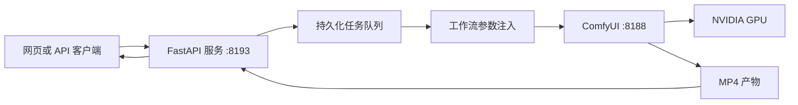

<div align="center">

# MiniMax H3 API

面向 MiniMax H3 FL2VA、Ref2VA 和数字人的 ComfyUI 视频生成服务

[](https://www.python.org/)
[](https://fastapi.tiangolo.com/)
[](https://github.com/comfyanonymous/ComfyUI)
[](https://huggingface.co/MiniMaxAI/MiniMax-H3)

中文 | [English](README.en.md)

[功能](#功能) · [执行方案](#执行方案) · [快速部署](#快速部署) · [API 示例](#api-示例) · [文档](#文档)

</div>

MiniMax H3 API 将 ComfyUI 推理工作流封装为可部署的网页与 HTTP API。服务负责素材上传、参数校验、任务排队、实时进度、产物管理和隐私隔离，ComfyUI 负责 MiniMax H3 音视频推理。

项目包含 FL2VA、Ref2VA、8-step LoRA v1.0、单图音频驱动数字人和可选 H3 NSFW 工作流，适用于单张 24 GB NVIDIA GPU 的云端部署。

> [!IMPORTANT]
> 模型权重不会提交到 Git。安装前请确认已接受 MiniMax H3 Community License Agreement 及相关 LoRA、ComfyUI 和自定义节点的许可条件。

## 功能

- 提供响应式生成页面、素材库、任务修改、取消、删除和 MP4 下载。
- 支持 FL2VA 首帧与首尾帧生成，以及 Ref2VA 图片、视频、音频多参考生成。
- 集成 LightX2V MiniMax H3 8-step LoRA v1.0，固定 8 步采样。
- 支持单张人物图片和驱动音频生成数字人视频，视频长度跟随 1 至 15 秒音频。
- 提供持久化任务队列、Server-Sent Events 进度、公共日志和健康检查。
- 支持 OpenAI Chat Completions 兼容接口的 H3 提示词优化。
- 支持无痕任务，公共素材库和日志隐藏任务详情，任务结束 30 分钟后清理文件。
- 每次 ComfyUI 任务结束后调用 `/free` 卸载模型并释放显存。
- 提供固定版本模型清单、文件大小与 SHA-256 校验、systemd 用户服务和部署验证脚本。

## 架构



FastAPI 使用单个任务工作线程依次向 ComfyUI 提交任务。上传文件、任务状态和生成产物保存在项目的 `data/` 目录中。

## 执行方案

| 方案 | 模型与采样 | 参考素材 | 参数 |
|---|---|---|---|
| 普通 FL2VA | FL2VA FP8 Scaled，原生采样 | 1 张首帧，可选 1 张尾帧 | 1 至 15 秒，4 至 50 步 |
| 普通 Ref2VA | Ref2VA FP8 Scaled，原生采样 | 最多 9 张图片、3 段视频、3 段音频 | 1 至 15 秒，4 至 50 步 |
| 8-step FL2VA | FL2VA FP8 Scaled + 8-step LoRA v1.0 | 1 张首帧，可选 1 张尾帧 | 固定 8 步，LoRA 强度 1.0 |
| 8-step Ref2VA | Ref2VA FP8 Scaled + FL2VA 8-step LoRA v1.0 | 最多 9 张图片、3 段视频、3 段音频 | 固定 8 步，LoRA 强度 1.0 |
| 数字人 | Ref2VA FP8 Scaled，音频驱动 | 1 张人物图片、1 段驱动音频 | 音频决定时长，固定 20 步 |
| H3 NSFW | Ref2VA FP8 Scaled + NaughtyTimes LoRA | Ref2VA 参考素材 | 仅在无痕模式中启用 |

> [!NOTE]
> Ref2VA 专用 8-step LoRA 尚未发布。当前 Ref2VA 加速工作流使用 FL2VA 8-step LoRA v1.0，后续可在工作流和模型清单中替换。

### 数字人工作流

数字人模式保留人物身份、面部结构、服装和源音频，并根据驱动音频进行口型同步。页面中的时长控件会被禁用，最终视频长度使用音频的实际时长。

该工作流需要以下 ComfyUI 自定义节点：

- `VRGDG_MiniMaxH3AudioDrive`，来自 `comfyui-vrgamedevgirl`

`ComfyUI-SoundFlow` 可作为可选插件安装。当前 API 通过 `ffprobe` 获取音频时长，数字人工作流不调用 `SoundFlow_GetLength`。

> [!WARNING]
> `scripts/install.sh` 当前不会安装数字人插件。使用数字人模式前，需要将 `comfyui-vrgamedevgirl` 放入 `ComfyUI/custom_nodes/`，安装其依赖并重启 ComfyUI。基础 FL2VA、Ref2VA 和 8-step LoRA 工作流不依赖该插件。

## 系统要求

以下配置用于单任务运行：

| 项目 | 要求 |
|---|---|
| 操作系统 | Ubuntu 22.04 x86_64 |
| GPU | 1 张 24 GB NVIDIA GPU，已验证 RTX 4090 |
| 驱动 | NVIDIA 550.54.14 或更高版本，支持 CUDA 12.4 Runtime |
| 内存 | 64 GB RAM，并配置至少 32 GB swap |
| 存储 | 至少 100 GB 可用 SSD 空间 |
| Python | 3.11 或更高版本 |
| 工具 | Git、FFmpeg、aria2、rsync、curl、OpenSSL、systemd |

64 GB 内存为 608 x 352、5 秒单任务的最低基线。更高分辨率、15 秒视频和其他并行 GPU 服务需要更多内存与存储空间。

## 快速部署

在云 GPU 服务器中执行：

```bash
git clone https://github.com/SekiyoKana/minimax-h3-api.git
cd minimax-h3-api

INSTALL_ROOT=/data/minimax-h3-stack \
GPU_ID=0 \
MODEL_PROVIDER=modelscope \
bash scripts/install.sh
```

安装脚本会执行以下操作：

1. 安装固定版本的 ComfyUI 和 ComfyUI-VideoHelperSuite。
2. 创建 ComfyUI 与 API 的独立 Python 虚拟环境。
3. 下载约 65.4 GB 必需模型，并校验文件大小和 SHA-256。
4. 生成 `.env`，配置指定 GPU 和随机无痕授权码。
5. 安装并启动 `comfyui.service` 与 `minimax-h3-api.service`。

安装完成后访问：

| 地址 | 用途 |
|---|---|
| `http://SERVER_IP:8193/` | 视频生成页面 |
| `http://SERVER_IP:8193/docs` | OpenAPI 交互文档 |
| `http://SERVER_IP:8193/health` | 服务健康检查 |

仅需对用户开放 8193 端口。ComfyUI 默认监听 `127.0.0.1:8188`。

> [!TIP]
> 使用其他物理 GPU 时设置 `GPU_ID`。安装脚本会将该值写入 `CUDA_VISIBLE_DEVICES`，单个工作流任务只使用一张 GPU。

完整参数、已有模型目录和公网部署要求见[部署文档](docs/DEPLOYMENT.md)。

## 页面使用

1. 添加首帧、尾帧或 Ref2VA 参考素材。
2. 选择生成模型和执行方案。
3. 设置画面比例、分辨率、时长和采样步数。
4. 输入场景、人物、动作、镜头和声音提示词。
5. 提交任务，在运行窗口查看队列和进度。

数字人模式需要添加一张人物图片和一段 1 至 15 秒驱动音频。提示词主要描述场景、构图、表情、动作、镜头和光线，服务会自动加入人物一致性、口型同步和源音频保持约束。

## API 示例

创建 8-step FL2VA 任务：

```bash
curl -X POST http://127.0.0.1:8193/api/v1/generations \
  -F 'prompt=固定镜头，人物站在窗边，窗帘轻微摆动，环境安静。' \
  -F 'reference_manifest=[{"type":"image"}]' \
  -F 'references=@first-frame.png;type=image/png' \
  -F 'model_variant=fl2va-fp8' \
  -F 'execution_mode=turbo-lora' \
  -F 'width=864' \
  -F 'height=480' \
  -F 'duration=5' \
  -F 'steps=8'
```

创建数字人任务：

```bash
curl -X POST http://127.0.0.1:8193/api/v1/generations \
  -F 'prompt=人物在工作室内正视镜头自然讲话，固定机位，柔和正面光。' \
  -F 'reference_manifest=[{"type":"image"},{"type":"audio"}]' \
  -F 'references=@character.png;type=image/png' \
  -F 'references=@speech.wav;type=audio/wav' \
  -F 'model_variant=ref2va-fp8' \
  -F 'execution_mode=digital-human' \
  -F 'width=864' \
  -F 'height=480' \
  -F 'duration=5' \
  -F 'steps=20'
```

数字人请求中的 `duration` 用于兼容表单协议，任务会使用驱动音频的实际时长。查询、修改、取消、删除、下载、SSE 和提示词优化接口见 [API 文档](docs/API.md)。

设置 `H3_API_KEY` 后，所有 `/api/v1/*` 请求需要携带：

```http
Authorization: Bearer YOUR_API_KEY
```

## 配置

安装后的主要配置保存在 `<INSTALL_ROOT>/minimax-h3-api/.env`：

| 环境变量 | 默认值 | 说明 |
|---|---|---|
| `H3_HOST` | `0.0.0.0` | API 监听地址 |
| `H3_PORT` | `8193` | 页面与 API 端口 |
| `H3_COMFY_URL` | `http://127.0.0.1:8188` | ComfyUI 地址 |
| `H3_API_KEY` | 空 | 可选 Bearer Token |
| `H3_INCOGNITO_CODE` | 随机值 | 无痕模式授权码 |
| `H3_MAX_UPLOAD_MB` | `512` | 单个上传文件大小上限 |
| `CUDA_VISIBLE_DEVICES` | `GPU_ID` | ComfyUI 使用的物理 GPU |

修改配置后执行：

```bash
systemctl --user restart minimax-h3-api.service
```

涉及 ComfyUI、模型或自定义节点的修改需要重启两个服务：

```bash
systemctl --user restart comfyui.service minimax-h3-api.service
```

## 验证

检查 Python 测试、模型校验、必要节点、服务健康状态和队列：

```bash
INSTALL_ROOT=/data/minimax-h3-stack bash scripts/verify_install.sh
```

可选生成测试会提交一个 608 x 352、5 秒、固定 8 步的无痕任务：

```bash
INSTALL_ROOT=/data/minimax-h3-stack bash scripts/smoke_generation.sh
```

## 项目结构

```text
app/                 FastAPI、任务队列、ComfyUI 客户端和提示词规则
static/              网页界面
workflows/           ComfyUI API 格式工作流
scripts/             安装、模型下载、校验和生成测试
deploy/              systemd 用户服务模板
docs/                API、部署、模型、工作流和运维文档
tests/               服务契约测试
model-manifest.json  模型来源、大小、SHA-256 和许可元数据
```

## 文档

- [云 GPU 部署](docs/DEPLOYMENT.md)
- [API 请求](docs/API.md)
- [模型清单](docs/MODELS.md)
- [工作流清单](docs/WORKFLOWS.md)
- [运行维护](docs/OPERATIONS.md)
- [验证快照](docs/PROJECT_SNAPSHOT.md)
- [安全说明](SECURITY.md)
- [第三方项目与许可](THIRD_PARTY_NOTICES.md)
- [英文文档](README.en.md)
