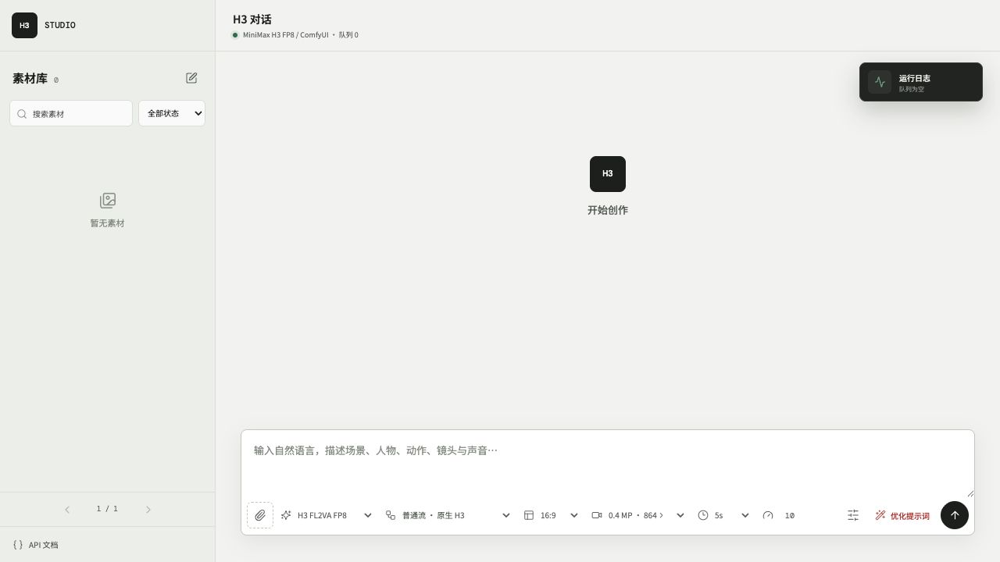
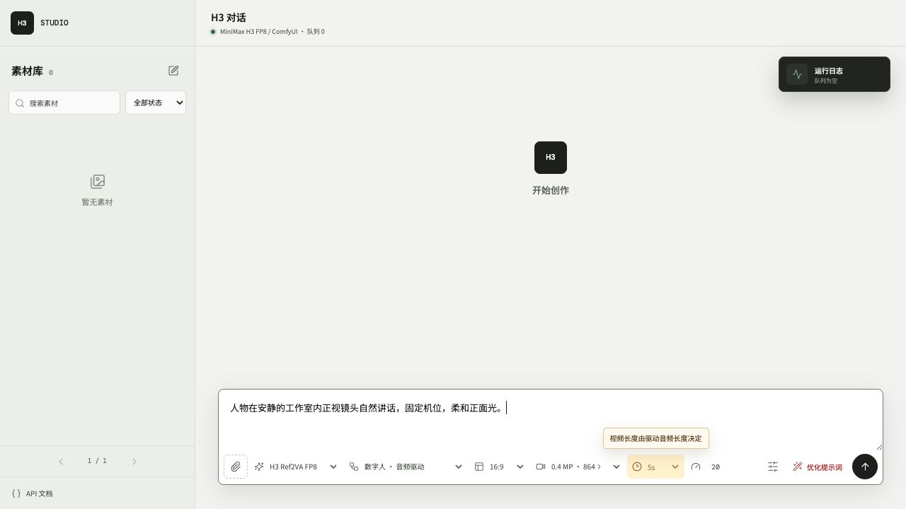
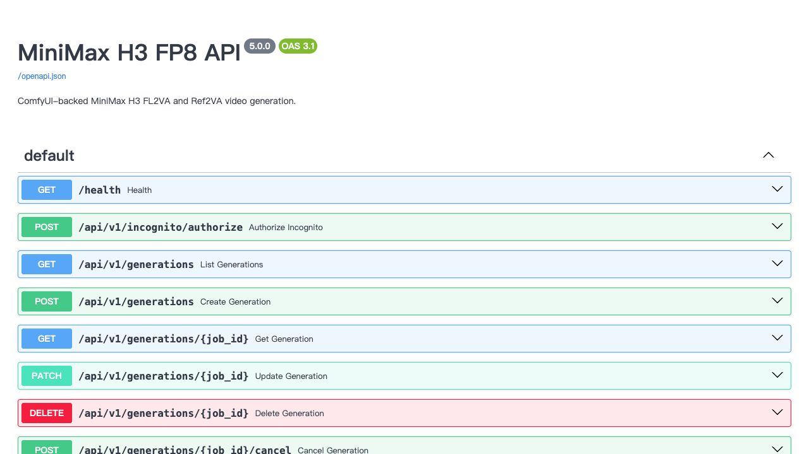
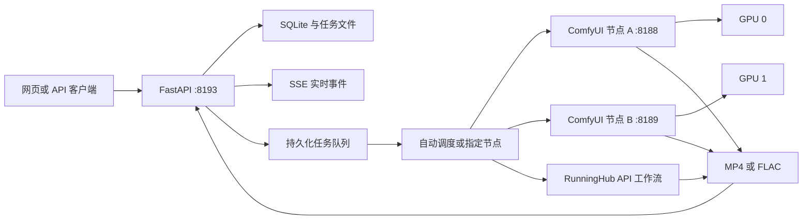

<div align="center">


# MiniMax H3 Studio

面向 MiniMax H3 视频、人物语音和 MiniMax Music3 音乐生成的 FastAPI、ComfyUI、RunningHub 与桌面应用

[](https://www.python.org/)
[](https://fastapi.tiangolo.com/)
[](https://github.com/comfyanonymous/ComfyUI)
[](https://huggingface.co/MiniMaxAI/MiniMax-H3)
[](https://huggingface.co/MiniMaxAI/MiniMax-Music3)

中文 | [English](README.en.md)

[功能更新](#功能更新) · [生成方案](#生成方案) · [快速部署](#快速部署) · [桌面应用](#桌面应用) · [多节点调度](#多节点调度) · [API](#api) · [文档](#文档)

</div>

项目提供服务端和桌面两种运行形态。服务端将 ComfyUI 与 RunningHub 工作流封装为响应式网页与 HTTP API，统一处理素材上传、参数校验、任务排队、实时进度、节点调度、产物管理和隐私隔离。桌面版在本机运行 FastAPI 与 pywebview，仅将推理请求发送到远端 ComfyUI，任务、素材、生成结果、节点配置和 AI 配置保留在本机。当前包含 H3 FL2VA、Ref2VA、8-step LoRA v1.0、数字人音频驱动、H3 TTS、Music3 INT8 及可选 H3 NSFW 工作流。



> [!IMPORTANT]
> 模型权重不会提交到 Git。部署前请确认已接受 MiniMax H3、MiniMax Music3、相关 LoRA、ComfyUI 和自定义节点的许可条件。

## 功能更新

### 2026-08-18

**macOS 与 Windows 桌面应用**

- 桌面端只连接远端 ComfyUI，本机保存任务、素材、生成结果、节点配置和 AI 配置。
- AI 服务 API Key 由本机 SQLite 保存，网页端不使用 `localStorage` 或 `sessionStorage` 保存密钥。
- 支持本机名称、局域网一次性验证码配对、持久授权、主动撤销和带归属方标签的共享素材库。
- 提供 pywebview 运行入口和 PyInstaller 打包脚本，详见[桌面应用文档](docs/DESKTOP.md)。

**H3 TTS 人物语音**

- 新增 H3 TTS 工作流。输入为人物特征、说话方式和对白，可选 0 至 3 段人物音频参考，支持多人对话。
- 工作流将画面潜变量固定为 32×32，仅解码音频并输出 FLAC，不保留 MP4 视频结果。
- TTS 提示词优化会按人物定义、音频参考、说话者编号、对白顺序和声音环境生成六段式 H3 提示词。对白保留原始语言和原文。
- 素材库中的已完成产物可以通过按钮或拖拽加入发送区，音频产物可继续作为 TTS 的人物音频参考。

### 2026-08-17

**RunningHub API 节点**

- 推理节点新增 `comfyui` 与 `runninghub` 两种类型，创建任务时可自动调度或手动指定。
- RunningHub 节点配置 API Key、工作流或 AI 应用地址和最大并发数，服务端自动解析资源 ID、工作流名称、输入参数和输出类型。
- RunningHub API Key 仅保存在服务端 SQLite，节点接口只返回密钥保存状态。
- 调度容量按可用节点槽位总数计算。ComfyUI 节点容量为 1，RunningHub 节点容量由最大并发数控制。
- RunningHub 节点状态显示当前 API Key 的账户余额、账户任务数和最近一次调用的余额差值。账户查询失败会保留最近一次数据并记录错误，不会将节点标记为离线。
- 按 [RunningHub 官方 API 文档](https://www.runninghub.ai/runninghub-api-doc-en/) 支持通用 AI 应用与普通工作流。页面根据工作流参数定义动态显示文本、数值、枚举、开关和媒体输入。
- 选择 RunningHub 工作流后，页面隐藏本地 ComfyUI 的模型、执行方案、分辨率、时长和步数控件，改为显示该工作流的动态参数。
- RunningHub 任务支持素材字段映射、回填发送区和重新生成，动态参数与媒体字段绑定会保存在任务记录中。

**生成编辑器**

- 底部参数、快捷入口、高级设置和发送按钮合并为单行工具栏。
- 新增 `@` 悬浮菜单，可插入已上传图片名称并调用快捷功能。H3 提供提示词优化，Music3 提供曲风优化和歌词优化。

### 2026-08-14

**Music3 INT8**

- 新增 MiniMax Music3 INT8 工作流，支持音乐描述与分段歌词输入，最长 300 秒。
- Music3 API 任务启用强制时长模式，在请求时长达到前屏蔽模型结束标记，输出长度按请求时长生成。
- 输出 32 kHz、16-bit、立体声 FLAC，固定使用 30 步 Euler 采样。
- 新增 AI 编曲和 AI 写词。AI 编曲遵循 MiniMax Music3 官方 `music-caption-rewriter` Structured Caption 规范，AI 写词输出可直接用于 Music3 的分段标签歌词。
- Music3 CUDA 设备从当前执行任务的 ComfyUI 节点 `/system_stats` 读取。节点运行在指定 GPU 时，Music3 使用该节点对应的 CUDA 设备。

**多节点并发**

- 新增推理节点管理界面，支持 ComfyUI 与 RunningHub 节点的新增、查看、修改、启用、停用和删除。
- 节点 ID 由服务自动生成。节点地址和状态刷新间隔保存在 `data/config.db`。
- 默认每 60 秒刷新一次节点状态，页面可将间隔调整为 5 至 3600 秒。
- 支持自动负载均衡和手动指定节点。ComfyUI 节点容量固定为 1，RunningHub 节点容量由最大并发数决定，当前并行容量为全部在线节点槽位之和。
- 任务记录、运行窗口和素材详情显示实际执行主机。

**页面交互**

- 使用 Server-Sent Events 实时同步任务、队列、日志和节点状态，连接断开后自动重连。
- 对话首屏加载最近 10 条记录，上滑继续加载历史记录。
- 素材库滚动触底继续加载，筛选和搜索使用分页接口。
- 素材库中的 Music3 音频使用单个音频图标展示，点击后在素材详情中播放。
- 素材点击后打开详情弹框，可查看产物、输入文件和提示词，并支持回填发送区和删除记录。
- 对话流新增回填发送区功能。
- 新增中英文切换和 API 文档入口，完成手机与窄屏布局适配。

**资源管理**

- 每个 ComfyUI 任务结束后调用 `/free`，卸载模型并释放显存。成功、失败和取消状态均执行释放流程。

### 2026-08-13

- 重写中英文项目文档，并加入工作台、数字人和 OpenAPI 页面截图。

### 2026-08-12

- 新增单图音频驱动数字人工作流。视频长度由驱动音频长度决定，页面时长控件禁用并显示说明。
- 将 4 步加速工作流升级为 LightX2V MiniMax H3 8-step LoRA v1.0。
- Ref2VA 专用 8-step LoRA 尚未发布，当前 Ref2VA 加速工作流临时使用 FL2VA 8-step LoRA v1.0。

### 2026-08-07

- 完成 FL2VA、Ref2VA、任务队列、素材库、无痕模式、安装脚本和 systemd 用户服务的部署基线。

## 生成方案

| 方案 | 模型与采样 | 输入 | 参数与产物 |
|---|---|---|---|
| 普通 FL2VA | FL2VA FP8 Scaled | 1 张首帧，可选 1 张尾帧 | 1 至 15 秒，4 至 50 步，MP4 |
| 普通 Ref2VA | Ref2VA FP8 Scaled | 最多 9 张图片、3 段视频、3 段音频 | 1 至 15 秒，4 至 50 步，MP4 |
| 8-step FL2VA | FL2VA FP8 Scaled 与 8-step LoRA v1.0 | 1 张首帧，可选 1 张尾帧 | 固定 8 步，LoRA 强度 1.0，MP4 |
| 8-step Ref2VA | Ref2VA FP8 Scaled 与 FL2VA 8-step LoRA v1.0 | 最多 9 张图片、3 段视频、3 段音频 | 固定 8 步，LoRA 强度 1.0，MP4 |
| 数字人 | Ref2VA FP8 Scaled，音频驱动 | 1 张人物图片、1 段驱动音频 | 音频决定长度，固定 20 步，MP4 |
| Music3 | Music3 DiT INT8 与文本编码器 INT8 | 音乐描述、可选分段歌词 | 1 至 300 秒，固定 30 步，FLAC |
| H3 TTS | Ref2VA FP8 Scaled | 人物特征、对白、0 至 3 段音频参考 | 1 至 15 秒，4 至 50 步，32×32 音频-only，FLAC |
| H3 NSFW | Ref2VA FP8 Scaled 与 NaughtyTimes LoRA | Ref2VA 参考素材 | 仅限无痕模式，MP4 |
| RunningHub | 目标 AI 应用或 API 工作流定义的模型 | 工作流定义的文本、数值、枚举、开关及媒体字段 | 参数与输出类型由目标工作流决定 |

### 数字人

数字人模式保留人物身份、面部结构、服装和源音频，并根据音频驱动口型。服务通过 `ffprobe` 读取音频实际时长，任务请求中的视频时长会被音频时长覆盖。



该工作流需要 `comfyui-vrgamedevgirl` 提供的 `VRGDG_MiniMaxH3AudioDrive` 节点。`ComfyUI-SoundFlow` 为可选插件，当前 API 工作流不调用 `SoundFlow_GetLength`。

> [!WARNING]
> `scripts/install.sh` 当前未安装数字人插件。启用数字人前，需要将 `comfyui-vrgamedevgirl` 安装到 `ComfyUI/custom_nodes/` 并重启对应 ComfyUI 节点。

### Music3

Music3 使用 ComfyUI 原生 `MiniMaxMusic3TextEncode`、`EmptyMiniMaxMusic3LatentAudio` 节点和 ComfyUI-MultiGPU 的 `CLIPLoaderMultiGPU`。服务向工作流写入执行节点报告的 CUDA 设备，避免文本编码器回退到 CPU。API 任务启用强制时长模式，在目标时长前屏蔽 `<|audio_end|>`，达到目标时长后停止解码。

> [!NOTE]
> `comfy-kitchen` 需要与服务器驱动支持的 CUDA Runtime 兼容。已验证服务器使用 NVIDIA 驱动 `575.51.03` 和 CUDA 12.9 本地构建。若日志出现 `CUDA driver version is insufficient for CUDA runtime version`，请检查 wheel 的 CUDA 版本和服务器驱动支持范围。

### H3 TTS

TTS 模式使用 Ref2VA FP8 工作流生成角色语音。每段上传的音频按 `<Audio 1>`、`<Audio 2>`、`<Audio 3>` 顺序作为说话者音色参考；提示词中的说话者使用 `(S1)`、`(S2)` 等编号，并在对白前标注原始语言，例如 `<d>[中文] 你好。</d>`。多人对话需要在文本中明确每句对白的说话者。

服务向工作流写入 `width=32`、`height=32`，节点 `121` 使用 `VAEDecodeAudio` 解码音频，节点 `92` 使用 `SaveAudio` 保存 FLAC。工作流不包含视频解码、视频合成或视频保存节点。TTS 时长为 1 至 15 秒，采样步数为 4 至 50。

### RunningHub 通用工作流

RunningHub 节点使用工作流或 AI 应用的完整官方地址完成绑定。服务从地址解析资源类型与资源 ID，读取工作流名称、输入参数和输出类型，并将账户余额、当前任务数和最近一次调用消耗写入节点状态。

动态参数支持文本、整数、浮点数、枚举、开关、图片、视频、音频和普通文件。媒体素材可以自动按类型分配，也可以使用字段键定向绑定。任务回填与重新生成会校验原工作流资源 ID，避免参数提交到其他工作流。

> [!IMPORTANT]
> 节点配置必须填写 `runninghub.ai` 或 `runninghub.cn` 的完整 HTTPS 工作流地址或 AI 应用地址。单独填写资源 ID 无法创建节点。

## 页面功能

| 区域 | 功能 |
|---|---|
| 生成区 | 模型、执行方案、节点、比例、分辨率、时长、步数、随机种子和无痕模式 |
| 提示词 | H3 提示词优化、Music3 AI 编曲、AI 写词和流式输出 |
| 对话流 | 最近 10 条、上滑加载、进度、主机标记、下载、修改、取消、删除和回填 |
| 素材库 | 触底加载、搜索、状态筛选、详情弹框、素材预览、回填和删除 |
| 节点管理 | ComfyUI 与 RunningHub 节点增删改查、自动 ID、健康状态、并发数、检测间隔和启停控制 |
| 页面设置 | 中英文切换、OpenAPI 文档入口和响应式移动端布局 |



## 系统架构



FastAPI 为每个 ComfyUI 节点创建一个任务工作线程，并按 RunningHub 节点的最大并发数创建对应数量的任务槽位。参考素材通过目标节点 API 上传，生成结果通过 HTTP 回传。

## 系统要求

以下基线适用于单任务运行：

| 项目 | 要求 |
|---|---|
| 操作系统 | Ubuntu 22.04 x86_64 |
| GPU | 1 张 24 GB NVIDIA GPU，已验证 RTX 4090 |
| 驱动 | NVIDIA 550.54.14 或更高版本，具体版本需满足已安装 CUDA Runtime |
| 内存 | 64 GB RAM，并配置至少 32 GB swap |
| 存储 | 至少 100 GB 可用 SSD 空间 |
| Python | 3.11 或更高版本 |
| 工具 | Git、FFmpeg、aria2、rsync、curl、OpenSSL、systemd |

64 GB 内存为 608 × 352、5 秒单任务的部署基线。高分辨率、长视频和多节点并行运行需要增加内存与存储空间。

## 快速部署

在云 GPU 服务器中执行：

```bash
git clone https://github.com/SekiyoKana/minimax-h3-api.git
cd minimax-h3-api

INSTALL_ROOT=/data/minimax-h3-stack \
GPU_ID=0 \
MODEL_PROVIDER=modelscope \
bash scripts/install.sh
```

安装脚本会完成以下操作：

1. 安装固定版本的 ComfyUI、ComfyUI-VideoHelperSuite 和 ComfyUI-MultiGPU。
2. 创建 ComfyUI 与 API 的独立 Python 虚拟环境。
3. 优先从 ModelScope 下载约 77.3 GB 模型，并校验文件大小和 SHA-256。
4. 生成 `.env` 和随机无痕授权码。
5. 安装并启动 `comfyui.service` 与 `minimax-h3-api.service`。

安装完成后访问：

| 地址 | 用途 |
|---|---|
| `http://SERVER_IP:8193/` | 生成页面 |
| `http://SERVER_IP:8193/docs` | OpenAPI 交互文档 |
| `http://SERVER_IP:8193/health` | 服务、队列和节点健康状态 |

仅需向用户开放 8193 端口。默认 ComfyUI 监听 `127.0.0.1:8188`。

完整安装参数、已有模型目录和公网部署要求见[云 GPU 部署文档](docs/DEPLOYMENT.md)。

## 桌面应用

桌面应用适用于 macOS 和 Windows。应用在本机启动 FastAPI 服务和 pywebview 窗口，默认连接远端 ComfyUI：

```text
http://100.77.224.102:8188
```

桌面版与云端服务的职责边界如下：

| 组件 | 位置 | 内容 |
|---|---|---|
| 桌面应用 | 本机 | Web 界面、任务记录、上传素材、生成结果、节点配置、AI 配置和共享授权 |
| SQLite | 本机 | ComfyUI 与 RunningHub 节点、AI API Key、本机名称、互联设备和持久授权令牌 |
| ComfyUI | 远端 | 模型加载、GPU 推理和工作流执行 |
| RunningHub | 远端 API | 可选的工作流或 AI 应用调用 |

AI API Key 和节点密钥由本机 SQLite 管理，不写入 `localStorage`、`sessionStorage`、任务 JSON 或素材文件。桌面应用的普通 API 仅允许本机回环访问，互联配对与共享素材接口允许局域网和 Tailscale 地址访问。

### 本地运行

```bash
python3 -m venv .venv-desktop
. .venv-desktop/bin/activate
pip install -r requirements-desktop.txt
python scripts/run_desktop.py
```

可通过环境变量覆盖远端 ComfyUI 与本机端口：

```bash
H3_DEFAULT_COMFY_URL=http://192.168.1.20:8188 \
H3_DEFAULT_COMFY_NAME="远端 ComfyUI" \
H3_DESKTOP_PORT=38193 \
python scripts/run_desktop.py
```

本机数据目录：

| 系统 | 目录 |
|---|---|
| macOS | `~/Library/Application Support/MiniMax H3 Studio` |
| Windows | `%LOCALAPPDATA%\\MiniMax H3 Studio` |

### 打包应用

在目标系统中安装依赖并构建。PyInstaller 需要在目标系统执行，不能将 macOS 构建产物作为 Windows 应用使用。

```bash
pip install -r requirements-desktop.txt
python scripts/build_desktop.py
```

macOS 构建会生成以下文件：

```text
dist/MiniMaxH3Studio.app
dist/MiniMaxH3Studio.dmg
```

DMG 包含 H3 Studio 应用图标和 `Applications` 快捷入口，可以将应用直接拖入该入口完成安装。Windows 输出 `dist/MiniMaxH3Studio/`，入口为 `MiniMaxH3Studio.exe`。完整的桌面运行、打包和互联说明见[桌面应用文档](docs/DESKTOP.md)。

### 多端互联

两个设备在同一局域网或 Tailscale 可达环境下，可以共享已完成的素材。共享素材带有归属方标签，授权令牌保存在双方本机 SQLite 中。

1. 在两个设备中设置本机名称。
2. 点击右上角密钥图标并开启互联。
3. 将本机互联密钥中的地址和六位验证码提供给另一台设备。
4. 另一台设备输入地址和验证码，建立互联授权。
5. 在共享素材库中查看带归属方标签的素材，并下载或作为输入使用。

验证码每 30 秒刷新一次，仅当前和上一周期有效。成功配对后不需要重复验证，任一设备可以主动撤销授权。

## 多节点调度

页面标题区域的服务器图标用于管理 ComfyUI 与 RunningHub 推理节点。新增节点时选择节点类型并填写名称，节点 ID 自动生成。创建任务时可以选择 ComfyUI 自动调度、指定节点，或选择某个 RunningHub 工作流的自动调度入口。同一 RunningHub 资源 ID 对应的可用节点共享并发容量。

RunningHub 节点需要填写名称、API Key、工作流或 AI 应用的完整 RunningHub 地址和最大并发数。服务会从地址确定 API 基础地址，并读取资源 ID、工作流名称、参数定义和输出类型。API Key 不会通过节点查询接口返回，编辑节点时留空会保留当前密钥。

AI 应用参数来自官方 `apiCallDemo` 和 `webapp/detail` 接口，普通工作流参数来自 `getJsonApiFormat`。选择 RunningHub 节点后，页面隐藏 H3 固定模型、尺寸、时长和步数控件，并按目标工作流显示对应字段。账户状态查询失败会记录 `account_error`，不会阻止已识别工作流继续使用。

支持的地址路径包括 `/ai-detail/{id}`、`/workflow/{id}`、`/workflow-detail/{id}` 和 `/post/{id}`，可包含 `zh-cn` 等语言路径前缀。节点名称与工作流名称分别保存，页面选择器显示已识别的工作流名称。

同一服务器部署多个节点时，每个 ComfyUI 实例需要使用独立端口、GPU、用户目录和数据库。例如：

| 节点 | API 地址 | GPU | 建议配置 |
|---|---|---|---|
| GPU 0 | `http://127.0.0.1:8188` | `CUDA_VISIBLE_DEVICES=0` | 独立 `user-directory` 和 `database-url` |
| GPU 1 | `http://127.0.0.1:8189` | `CUDA_VISIBLE_DEVICES=1` | 独立 `user-directory` 和 `database-url` |

节点和设置保存在：

```text
data/config.db
├── comfy_nodes       节点、密钥、工作流参数定义、账户数据、最近调用费用和并发配置
└── service_settings  comfy_health_seconds，默认 60 秒
```

> [!TIP]
> 远程 ComfyUI 节点的 URL 必须能从 API 服务访问。跨主机部署时应在网络层限制 ComfyUI 端口的访问范围。

## API

### 创建 8-step FL2VA 任务

```bash
curl -X POST http://127.0.0.1:8193/api/v1/generations \
  -F 'prompt=固定镜头，人物站在窗边，窗帘轻微摆动，环境安静。' \
  -F 'reference_manifest=[{"type":"image"}]' \
  -F 'references=@first-frame.png;type=image/png' \
  -F 'model_variant=fl2va-fp8' \
  -F 'execution_mode=turbo-lora' \
  -F 'comfy_node=auto' \
  -F 'width=864' \
  -F 'height=480' \
  -F 'duration=5' \
  -F 'steps=8'
```

### 创建 Music3 任务

```bash
curl -X POST http://127.0.0.1:8193/api/v1/generations \
  -F 'prompt=Upbeat synth-pop, 118 BPM, bright female vocal, layered analog synths.' \
  -F 'lyrics=[Verse]\nCity lights are moving slow\n\n[Chorus]\nWe are awake tonight' \
  -F 'model_variant=music3-int8' \
  -F 'execution_mode=music3' \
  -F 'comfy_node=auto' \
  -F 'duration=120' \
  -F 'steps=30'
```

### 创建 H3 TTS 任务

TTS 支持 0 至 3 段音频参考。0 样本请求省略 `reference_manifest` 和 `references`，声音根据提示词中的人物特征生成：

```bash
curl -X POST http://127.0.0.1:8193/api/v1/generations \
  -F 'prompt=(S1) 成年女性，语速平稳，语气克制。<d>[中文] 你好，今天开始录音。</d>' \
  -F 'model_variant=ref2va-fp8' \
  -F 'execution_mode=tts' \
  -F 'comfy_node=auto' \
  -F 'duration=5' \
  -F 'steps=20'
```

需要参考音频时，设置与上传文件数量一致的 `reference_manifest`，并按说话者顺序提交 `references`。TTS 固定使用 32×32 音频工作流，输出 FLAC。

### 创建 RunningHub 任务

字段键需要从 `GET /api/v1/comfy/nodes` 返回的 `runninghub_schema` 中读取：

```bash
curl -X POST http://127.0.0.1:8193/api/v1/generations \
  -F 'comfy_node=rh:2086401261143273474' \
  -F 'prompt=人物在室内缓慢转身，固定镜头，动作自然。' \
  -F 'runninghub_parameters={"89.aspect_ratio":"16:9 (Widescreen)","37.value":8}' \
  -F 'reference_manifest=[{"type":"image","field_key":"36.image"}]' \
  -F 'references=@reference.png;type=image/png'
```

`rh:<resource_id>` 会在绑定同一资源的可用 RunningHub 节点之间调度。填写具体节点 ID 时，任务定向到该节点。

### 管理节点

```bash
# 节点 ID 由服务自动生成
curl -X POST http://127.0.0.1:8193/api/v1/comfy/nodes \
  -H 'Content-Type: application/json' \
  -d '{"name":"GPU 1","url":"http://127.0.0.1:8189"}'

curl -X POST http://127.0.0.1:8193/api/v1/comfy/nodes \
  -H 'Content-Type: application/json' \
  -d '{"name":"RunningHub 工作流","provider":"runninghub","api_key":"YOUR_RUNNINGHUB_API_KEY","workflow_url":"https://www.runninghub.ai/zh-cn/ai-detail/2086401261143273474","max_concurrency":2}'

curl -X PATCH http://127.0.0.1:8193/api/v1/comfy/settings \
  -H 'Content-Type: application/json' \
  -d '{"health_interval_seconds":60}'
```

主要接口：

| 方法 | 路径 | 功能 |
|---|---|---|
| `GET` | `/health` | 服务、队列、节点和并行容量 |
| `GET`、`POST` | `/api/v1/comfy/nodes` | 查询与新增节点 |
| `PATCH`、`DELETE` | `/api/v1/comfy/nodes/{node_id}` | 修改与删除节点 |
| `PATCH` | `/api/v1/comfy/settings` | 修改健康检查间隔 |
| `GET`、`POST` | `/api/v1/generations` | 分页查询与创建任务 |
| `GET` | `/api/v1/events` | SSE 任务、队列、日志和节点事件 |
| `POST` | `/api/v1/prompts/optimize` | H3 提示词优化 |
| `POST` | `/api/v1/music/assist` | Music3 AI 编曲与 AI 写词 |

设置 `H3_API_KEY` 后，所有 `/api/v1/*` 请求需要携带 Bearer Token。请求字段、数字人示例、分页、任务修改、取消、删除和下载见 [API 文档](docs/API.md)。

## 配置

主要环境变量保存在 `<INSTALL_ROOT>/minimax-h3-api/.env`：

| 环境变量 | 默认值 | 说明 |
|---|---|---|
| `H3_HOST` | `0.0.0.0` | API 监听地址 |
| `H3_PORT` | `8193` | 页面与 API 端口 |
| `H3_API_KEY` | 空 | 可选 Bearer Token |
| `H3_INCOGNITO_CODE` | 随机值 | 无痕模式授权码 |
| `H3_MAX_UPLOAD_MB` | `512` | 单个上传文件大小上限 |
| `H3_REMOTE_RECONNECT_SECONDS` | `120` | ComfyUI 或 RunningHub 查询中断后的单次重连窗口，单位为秒 |
| `CUDA_VISIBLE_DEVICES` | `GPU_ID` | 安装脚本创建的默认 ComfyUI 节点使用的物理 GPU |

节点地址和健康检查间隔通过页面或 API 修改，配置立即生效，无需重启 API 服务。

ComfyUI 返回 `prompt_id` 或 RunningHub 返回 `taskId` 后，服务会立即将远端任务 checkpoint 写入任务文件。API 服务重启后会保留已有进度，固定使用原节点继续查询远端任务，并在完成后下载产物。升级前已经提交且任务文件中没有 checkpoint 的活动任务需要完成后再重启 API 服务。

## 验证

以下命令检查代码测试、模型文件、必要节点、服务状态和队列，不会提交生成任务：

```bash
INSTALL_ROOT=/data/minimax-h3-stack bash scripts/verify_install.sh
```

检查单个节点状态：

```bash
curl -fsS http://127.0.0.1:8188/system_stats
curl -fsS http://127.0.0.1:8193/health
```

## 项目结构

```text
app/                 FastAPI、任务队列、节点调度、ComfyUI 客户端和提示词规则
desktop.py           pywebview 桌面入口与本机数据目录设置
requirements-desktop.txt  桌面运行与 PyInstaller 依赖
static/              中英文响应式网页
workflows/           H3 与 Music3 ComfyUI API 工作流
scripts/             安装、桌面运行、桌面打包、模型下载、校验和生成测试
deploy/              systemd 用户服务模板
docs/                API、部署、模型、工作流和运行维护文档
tests/               服务契约和桌面功能契约测试
model-manifest.json  模型来源、大小、SHA-256 和许可元数据
```

## 文档

- [云 GPU 部署](docs/DEPLOYMENT.md)
- [API 请求](docs/API.md)
- [模型清单](docs/MODELS.md)
- [工作流清单](docs/WORKFLOWS.md)
- [运行维护](docs/OPERATIONS.md)
- [验证快照](docs/PROJECT_SNAPSHOT.md)
- [安全说明](SECURITY.md)
- [第三方项目与许可](THIRD_PARTY_NOTICES.md)
- [英文 README](README.en.md)
