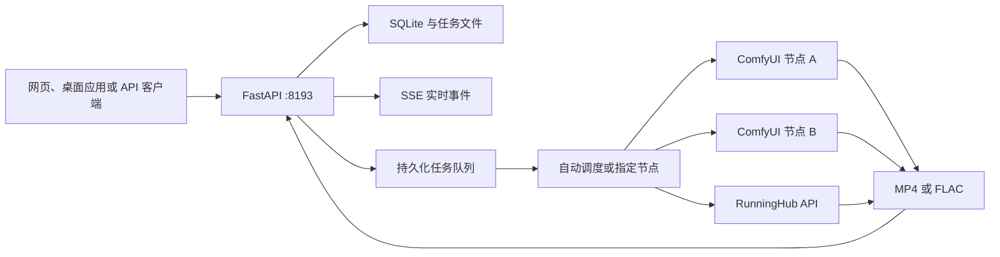

<div align="center">


# MiniMax H3 Studio

用于 MiniMax H3 视频、角色语音与 MiniMax Music3 音乐生成的 Web 服务和桌面应用

[](https://www.python.org/)
[](https://fastapi.tiangolo.com/)
[](https://github.com/Comfy-Org/ComfyUI)
[](https://huggingface.co/MiniMaxAI/MiniMax-H3)
[](https://huggingface.co/MiniMaxAI/MiniMax-Music3)

中文 | [English](README.en.md)

[功能](#功能) · [生成方案](#生成方案) · [ComfyUI 节点包](#comfyui-节点包) · [快速部署](#快速部署) · [桌面应用](#桌面应用) · [API](#api) · [文档](#文档)

</div>

MiniMax H3 Studio 可作为服务端应用或本地桌面应用运行。服务端通过响应式网页和 HTTP API 调用 ComfyUI 与 RunningHub 工作流，负责素材上传、参数校验、持久化队列、实时进度、节点调度和产物管理。桌面端在本机运行 FastAPI 与 pywebview，任务记录、素材、生成结果、节点配置和密钥均保存在本机。

当前支持 H3 FL2VA、Ref2VA、8-step LoRA v1.0、单图音频驱动数字人、H3 TTS、Music3 INT8、RunningHub 通用工作流及可选 H3 NSFW 工作流。


> [!IMPORTANT]
> 仓库不包含模型权重。部署前请确认已经接受 MiniMax H3、MiniMax Music3、相关 LoRA、ComfyUI 和自定义节点的许可条件。

## 功能

| 模块 | 能力 |
|---|---|
| 生成区 | 模型、执行方案、推理节点、宽高比、分辨率、时长、步数、随机种子和无痕模式 |
| 对话流 | 最近记录、上滑加载历史记录、设备筛选、实时进度、下载、修改、取消、删除和参数回填 |
| 素材库 | 分页加载、搜索、状态筛选、预览、详情、下载、回填和本地产物管理 |
| 节点管理 | ComfyUI 与 RunningHub 节点的新增、修改、启停、删除、健康检查和并发配置 |
| 提示词工具 | H3 提示词优化、Music3 曲风优化、Music3 歌词生成和流式输出 |
| 多端互联 | 局域网或 Tailscale 配对、持久化授权、授权撤销和带归属方标记的素材共享 |
| 运行日志 | 浮窗入口与详情窗口均可拖动，支持鼠标和触控操作 |

在设置中启用运行日志后，界面只显示浮窗入口，详情窗口保持关闭。任务状态刷新时会保留已选的设备筛选条件。

## 生成方案

| 方案 | 模型 | 输入 | 参数与产物 |
|---|---|---|---|
| 普通 FL2VA | FL2VA FP8 Scaled | 1 张首帧，可选 1 张尾帧 | 1 至 15 秒，4 至 50 步，MP4 |
| 普通 Ref2VA | Ref2VA FP8 Scaled | 最多 9 张图片、3 段视频和 3 段音频 | 1 至 15 秒，4 至 50 步，MP4 |
| 8-step FL2VA | FL2VA FP8 Scaled 与 8-step LoRA v1.0 | 1 张首帧，可选 1 张尾帧 | 固定 8 步，LoRA 强度 1.0，MP4 |
| 8-step Ref2VA | Ref2VA FP8 Scaled 与 FL2VA 8-step LoRA v1.0 | Ref2VA 参考素材 | 固定 8 步，LoRA 强度 1.0，MP4 |
| 数字人 | Ref2VA FP8 Scaled | 1 张人物图片和 1 段驱动音频 | 音频决定时长，固定 20 步，MP4 |
| H3 TTS | Ref2VA FP8 Scaled | 人物特征、对白、0 至 3 段音频参考 | 1 至 15 秒，4 至 50 步，FLAC |
| Music3 | Music3 DiT INT8 与文本编码器 INT8 | 音乐描述和可选分段歌词 | 1 至 300 秒，固定 30 步，FLAC |
| H3 NSFW | Ref2VA FP8 Scaled 与 NaughtyTimes LoRA | Ref2VA 参考素材 | 仅限无痕模式，MP4 |
| RunningHub | 目标工作流定义的模型 | 文本、数值、枚举、开关和媒体字段 | 参数与产物类型由目标工作流决定 |

### 数字人

数字人工作流使用人物图片和驱动音频生成口型同步视频。服务通过 `ffprobe` 读取音频实际时长，并用该时长覆盖任务中的视频时长。工作流需要 `VRGDG_MiniMaxH3AudioDrive` 节点。


### H3 TTS

H3 TTS 使用 Ref2VA FP8 生成角色语音。提示词用于描述人物特征、说话方式和对白，最多可以上传 3 段音频作为说话者音色参考。服务将视觉潜变量固定为 32×32，只解码音频并保存 FLAC。

### Music3

Music3 支持音乐描述与分段歌词，输出 32 kHz、16-bit、立体声 FLAC。API 工作流固定使用 30 步 Euler 采样，并通过仓库补丁启用强制时长控制。

### RunningHub

RunningHub 节点使用工作流或 AI 应用的完整 HTTPS 地址。服务读取资源 ID、工作流名称、参数定义和输出类型，并根据定义生成输入控件。API Key 保存在 SQLite 中，节点查询接口只返回密钥保存状态。

## ComfyUI 节点包

根目录的 [`comfyui_nodes/`](comfyui_nodes/) 保存所有工作流依赖的固定版本源码包。每个依赖单独压缩，并在 [`comfyui_nodes/manifest.json`](comfyui_nodes/manifest.json) 中记录来源、提交、许可和 SHA-256。

| 压缩包 | 用途 | 安装位置 |
|---|---|---|
| `ComfyUI-core-7fe8a61.zip` | 工作流引用的加载、采样、MiniMax H3、Music3 和音视频核心节点 | 作为 ComfyUI 主目录 |
| `ComfyUI-VideoHelperSuite-993082e.zip` | Ref2VA 视频参考的 `VHS_LoadVideo` | `ComfyUI/custom_nodes/` |
| `ComfyUI-MultiGPU-62f98ed.zip` | Music3 使用的 `CLIPLoaderMultiGPU` | `ComfyUI/custom_nodes/` |
| `comfyui-minimax-h3-audio-drive-de65ec5.zip` | 数字人使用的 `VRGDG_MiniMaxH3AudioDrive` | `ComfyUI/custom_nodes/` |

安装自定义节点时，解压对应文件，并将压缩包中的顶层目录放入 `ComfyUI/custom_nodes/`。如果目录中存在 `requirements.txt`，请使用运行 ComfyUI 的 Python 环境安装依赖。

> [!IMPORTANT]
> Music3 强制时长功能还需要应用 [`patches/comfyui-music3-force-duration.patch`](patches/comfyui-music3-force-duration.patch)。`scripts/install.sh` 会自动应用该补丁。

数字人压缩包仅包含当前工作流调用的 `VRGDG_MiniMaxH3AudioDrive`，并保留上游 AGPL-3.0 许可说明。当前 API 工作流不依赖 ComfyUI-SoundFlow。

## 系统架构



ComfyUI 节点的并发容量固定为 1。RunningHub 节点的容量由 `max_concurrency` 配置。自动调度会在在线节点的可用槽位之间分配任务。

## 系统要求

以下配置适用于单个 608×352、5 秒任务：

| 项目 | 要求 |
|---|---|
| 操作系统 | Ubuntu 22.04 x86_64 |
| GPU | 1 张 24 GB NVIDIA GPU，已在 RTX 4090 上验证 |
| 驱动 | NVIDIA 550.54.14 或更高版本，且满足 CUDA Runtime 要求 |
| 内存 | 64 GB RAM，并配置至少 32 GB swap |
| 存储 | 至少 100 GB 可用 SSD 空间 |
| Python | 3.11 或更高版本 |
| 工具 | Git、FFmpeg、aria2、rsync、curl、OpenSSL 和 systemd |

高分辨率、长视频和多节点并行任务需要更多内存与存储空间。

## 快速部署

在云 GPU 服务器中执行：

```bash
git clone https://github.com/SekiyoKana/minimax-h3-api.git
cd minimax-h3-api

INSTALL_ROOT=/data/minimax-h3-stack \
GPU_ID=0 \
MODEL_PROVIDER=modelscope \
bash scripts/install.sh
```

安装脚本会完成以下操作：

1. 安装固定版本的 ComfyUI、ComfyUI-VideoHelperSuite 和 ComfyUI-MultiGPU。
2. 创建 ComfyUI 与 API 的独立 Python 虚拟环境。
3. 下载约 77.3 GB 模型，并校验文件大小和 SHA-256。
4. 应用 Music3 强制时长补丁。
5. 生成 `.env` 和随机无痕授权码。
6. 安装并启动 `comfyui.service` 与 `minimax-h3-api.service`。

安装完成后访问：

| 地址 | 用途 |
|---|---|
| `http://SERVER_IP:8193/` | 生成页面 |
| `http://SERVER_IP:8193/docs` | OpenAPI 交互文档 |
| `http://SERVER_IP:8193/health` | 服务、队列和节点健康状态 |

默认只需向用户开放 8193 端口。ComfyUI 监听 `127.0.0.1:8188`。

完整安装参数见[云 GPU 部署文档](docs/DEPLOYMENT.md)。

## 桌面应用

桌面应用支持 macOS 和 Windows。本机负责界面、任务记录、素材、生成结果、节点配置、AI 配置和互联授权，远端 ComfyUI 负责模型加载与 GPU 推理。

### 本地运行

```bash
python3 -m venv .venv-desktop
. .venv-desktop/bin/activate
pip install -r requirements-desktop.txt
python scripts/run_desktop.py
```

可以通过环境变量修改远端节点和本机端口：

```bash
H3_DEFAULT_COMFY_URL=http://192.168.1.20:8188 \
H3_DEFAULT_COMFY_NAME="远端 ComfyUI" \
H3_DESKTOP_PORT=38193 \
python scripts/run_desktop.py
```

本机数据目录：

| 系统 | 目录 |
|---|---|
| macOS | `~/Library/Application Support/MiniMax H3 Studio` |
| Windows | `%LOCALAPPDATA%\\MiniMax H3 Studio` |

### 打包

```bash
pip install -r requirements-desktop.txt
python scripts/build_desktop.py
```

macOS 输出 `dist/MiniMaxH3Studio.app` 和 `dist/MiniMaxH3Studio.dmg`。Windows 输出位于 `dist/MiniMaxH3Studio/`。PyInstaller 需要在目标系统中执行。

完整说明见[桌面应用文档](docs/DESKTOP.md)。

## 多节点调度

页面顶部的服务器图标用于管理 ComfyUI 与 RunningHub 节点。节点地址、密钥、工作流定义、账户信息和健康检查间隔保存在 `data/config.db`。

同一服务器运行多个 ComfyUI 实例时，每个实例需要独立端口、GPU、用户目录和数据库。例如：

| 节点 | API 地址 | GPU |
|---|---|---|
| GPU 0 | `http://127.0.0.1:8188` | `CUDA_VISIBLE_DEVICES=0` |
| GPU 1 | `http://127.0.0.1:8189` | `CUDA_VISIBLE_DEVICES=1` |

远端节点地址必须能够从 API 服务访问。跨主机部署时，应在网络层限制 ComfyUI 端口的访问范围。

## API

创建 8-step FL2VA 任务：

```bash
curl -X POST http://127.0.0.1:8193/api/v1/generations \
  -F 'prompt=固定镜头，人物站在窗边，窗帘轻微摆动，环境安静。' \
  -F 'reference_manifest=[{"type":"image"}]' \
  -F 'references=@first-frame.png;type=image/png' \
  -F 'model_variant=fl2va-fp8' \
  -F 'execution_mode=turbo-lora' \
  -F 'comfy_node=auto' \
  -F 'width=864' \
  -F 'height=480' \
  -F 'duration=5' \
  -F 'steps=8'
```

主要接口：

| 方法 | 路径 | 功能 |
|---|---|---|
| `GET` | `/health` | 服务、队列、节点和并发容量 |
| `GET`、`POST` | `/api/v1/comfy/nodes` | 查询与新增节点 |
| `PATCH`、`DELETE` | `/api/v1/comfy/nodes/{node_id}` | 修改与删除节点 |
| `GET`、`POST` | `/api/v1/generations` | 分页查询与创建任务 |
| `GET` | `/api/v1/events` | SSE 任务、队列、日志和节点事件 |
| `POST` | `/api/v1/prompts/optimize` | H3 提示词优化 |
| `POST` | `/api/v1/music/assist` | Music3 曲风优化与歌词生成 |

设置 `H3_API_KEY` 后，所有 `/api/v1/*` 请求都需要 Bearer 令牌。完整字段和示例见 [API 文档](docs/API.md)。

## 配置

| 环境变量 | 默认值 | 说明 |
|---|---|---|
| `H3_HOST` | `0.0.0.0` | API 监听地址 |
| `H3_PORT` | `8193` | Web 与 API 端口 |
| `H3_API_KEY` | 空 | 可选 Bearer Token |
| `H3_INCOGNITO_CODE` | 随机值 | 无痕模式授权码 |
| `H3_MAX_UPLOAD_MB` | `512` | 单个上传文件的大小上限 |
| `H3_REMOTE_RECONNECT_SECONDS` | `120` | 远端任务状态查询的重连窗口 |
| `CUDA_VISIBLE_DEVICES` | `GPU_ID` | 默认 ComfyUI 节点使用的物理 GPU |

节点地址和健康检查间隔可以通过页面或 API 修改，配置会立即生效。

## 验证

运行全部测试：

```bash
python3 -m unittest discover -s tests -p 'test_*.py'
```

验证已部署的模型、节点、服务和队列：

```bash
INSTALL_ROOT=/data/minimax-h3-stack bash scripts/verify_install.sh
```

## 项目结构

```text
app/                  FastAPI、任务队列、节点调度和推理客户端
comfyui_nodes/        固定版本的 ComfyUI 与自定义节点压缩包
desktop.py            pywebview 桌面入口
static/               中英文响应式网页
workflows/            H3 与 Music3 ComfyUI API 工作流
patches/              ComfyUI 兼容与功能补丁
scripts/              安装、打包、模型下载、验证和生成测试
deploy/               systemd 用户服务模板
docs/                 API、部署、模型、工作流和运行维护文档
tests/                服务契约与桌面功能测试
model-manifest.json   模型来源、大小、SHA-256 和许可元数据
```

## 文档

- [云 GPU 部署](docs/DEPLOYMENT.md)
- [桌面应用](docs/DESKTOP.md)
- [API 请求](docs/API.md)
- [模型清单](docs/MODELS.md)
- [工作流清单](docs/WORKFLOWS.md)
- [ComfyUI 节点包](comfyui_nodes/README.md)
- [运行维护](docs/OPERATIONS.md)
- [验证快照](docs/PROJECT_SNAPSHOT.md)
- [安全说明](SECURITY.md)
- [第三方项目与许可](THIRD_PARTY_NOTICES.md)
